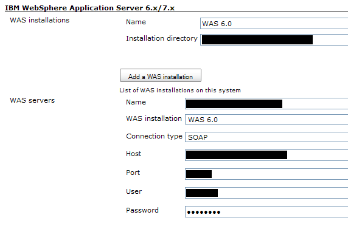
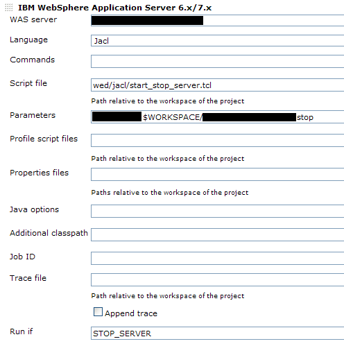

[.conf-macro .output-inline]#This plugin allows Jenkins to invoke IBM
WebSphere Application Server's *wsadmin* as a build step.#

[[WASBuilderPlugin-Aboutthisplugin]]
== About this plugin

This plugin allows to invoke the *wsadmin* command of IBM WebSphere
Application Server (WAS) 6.0/6.1/7.0 as a build step. It can be used for
example to deploy a freshly built application (self-promo: using the
https://wiki.jenkins-ci.org/display/JENKINS/RAD+Builder+Plugin[RAD
Builder Plugin]).

This plugin supports:

* WAS 6.0 (versions 1.0 to 1.6 successfully tested with WAS 6.0.2.15 –
should work with other 6.0.2.x versions)
* WAS 6.1 (not yet tested)
* WAS 7.0 (version 1.1 to 1.6 successfully tested with Administration
Thin Client built from WAS 7.0.0.7 – should work with other 7.0.0.x
versions)
* WAS 8.0 (version 1.6 successfully tested with full WebSphere v8 non-ND
installation – thanks Ilko Iliev for the feedback)

[[WASBuilderPlugin-Userguide]]
== User guide

Before adding a WAS build step to a job, the WAS Builder plugin must be
configured as follow:

* First, one or several WAS installations must be defined in Jenkins'
main configuration panel (cf. upper part of the screenshot below). These
WAS installations must not necessarily correspond to some running WAS
servers: The plugin simply uses their wsadmin command (the one located
in the `+bin+` folder of the installed product) to connect to remote
servers. +
[.confluence-embedded-file-wrapper .image-center-wrapper]##
* Once at least one installation is defined, you need to save the
changes and to go back to Jenkins' main configuration panel to be able
to define the servers that the jobs will use (lower part of the
screenshot above).

Once at least one server is defined, it's possible to add some "IBM
WebSphere Application Server 6.x/7.x" build steps to your jobs (cf.
screenshot below). Most of *wsadmin* options can be controlled through
the GUI. Take a look at the inline help (the little question marks
located on the right of each field) to know more about each feature. +
[.confluence-embedded-file-wrapper .image-center-wrapper]##

The *Run if* field doesn't correspond to a *wsadmin* option. It can be
used to dynamically enable/disable a build step for a particular run: If
*Run if* is defined (let's say with the `+STOP_SERVER+` value) for a
build step, then the build step will be run if and only if:

* a build variable with the same name (in our case, `+STOP_SERVER+`) is
defined and has a value,
* or (exclusive) if no build variable with the same name is defined and
an environment variable with the same name (still `+STOP_SERVER+` in our
example) is defined, whether it has a value or nor.

[.aui-icon .aui-icon-small .aui-iconfont-warning .confluence-information-macro-icon]#
#

When defining a build step for WAS 6.0, be sure to refer to the inline
help to know if you can use it: Some options (job ID, trace file, etc.)
are available only for WAS 6.1 or greater.

[.aui-icon .aui-icon-small .aui-iconfont-approve .confluence-information-macro-icon]#
#

Check-out
https://www.ibm.com/developerworks/mydeveloperworks/groups/service/forum/topicThread?topicUuid=56eb2ce6-5a76-48b2-ae96-9ee730c3548b[this
post] on IBM developerWorks to get an introduction on how this plugin
can be used (thanks Ilko).

[[WASBuilderPlugin-Versionhistory]]
== Version history

[[WASBuilderPlugin-Version1.6.1(10/20/2011)]]
=== Version 1.6.1 (10/20/2011)

* Fixed
https://issues.jenkins-ci.org/browse/JENKINS-11104[JENKINS-11104]:
`+wsadmin+` was not working when used with `+sudo+`

[[WASBuilderPlugin-Version1.6(08/07/2011)]]
=== Version 1.6 (08/07/2011)

* Update for Jenkins

[[WASBuilderPlugin-Version1.5(04/23/2010)]]
=== Version 1.5 (04/23/2010)

* Added a new *Wsadmin command* field (at the WAS installation level)
allowing to tweak the `+wsadmin.bat+`/`+wsadmin.sh+` command actually
run, for example to prefix it with `+sudo+`.
* The list of WAS servers is now alphabetically sorted when saving the
global configuration.

[[WASBuilderPlugin-Version1.4(04/13/2010)]]
=== Version 1.4 (04/13/2010)

* The *Run if* option now allows to use boolean parameters in addition
to build or environment variables.

[[WASBuilderPlugin-Version1.3(04/13/2010)]]
=== Version 1.3 (04/13/2010)

* Added an option which allows creating automatically, if the
https://wiki.jenkins-ci.org/display/JENKINS/Locks+and+Latches+plugin[locks-and-latches
plugin] is installed, one lock per defined WAS server.

[[WASBuilderPlugin-Version1.2(04/06/2010)]]
=== Version 1.2 (04/06/2010)

* Added an option for allowing the *wsadmin* user/password at the build
step level.

[[WASBuilderPlugin-Version1.1(03/30/2010)]]
=== Version 1.1 (03/30/2010)

* Added the support for
http://publib.boulder.ibm.com/infocenter/wasinfo/v7r0/topic/com.ibm.websphere.nd.multiplatform.doc/info/ae/ae/txml_adminclient.html[administration
thin clients].

[[WASBuilderPlugin-Version1.0.1(01/24/2010)]]
=== Version 1.0.1 (01/24/2010)

* Bug fix: Installations defined for slave nodes were not taken into
account; The plugin was always referring to the installation on the
master node.

[[WASBuilderPlugin-Version1.0(12/18/2009)]]
=== Version 1.0 (12/18/2009)

* Initial release
