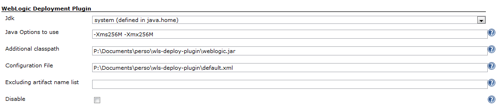
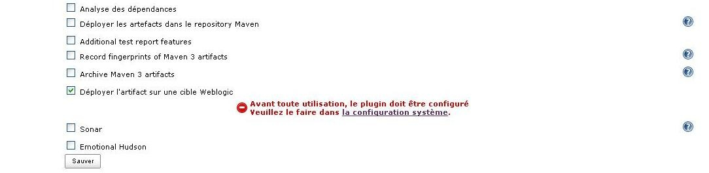
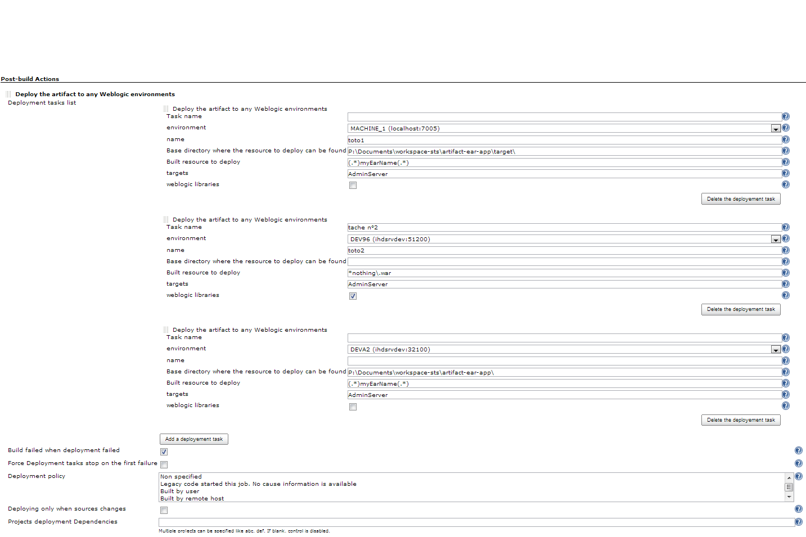
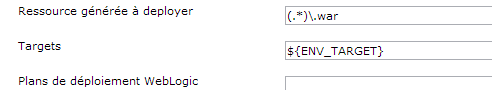
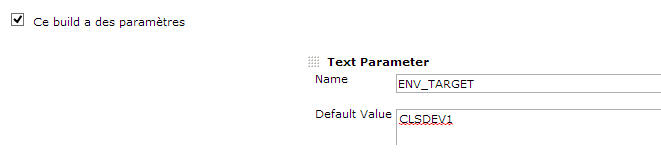
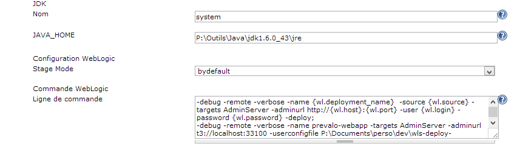
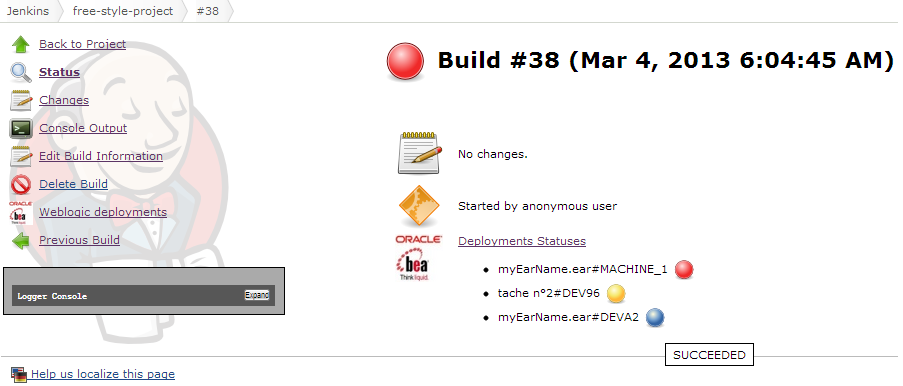
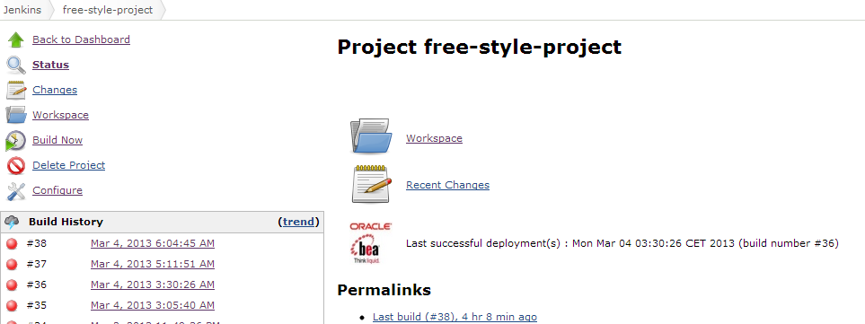
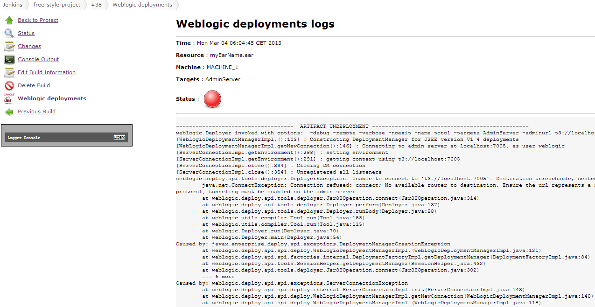

[.conf-macro .output-inline]##

[cols="",options="header",]
|===
|Plugin Information
|View Deploy WebLogic
https://plugins.jenkins.io/weblogic-deployer-plugin[on the plugin site]
for more information.
|===

[.aui-icon .aui-icon-small .aui-iconfont-error .confluence-information-macro-icon]##

The current version of this plugin may not be safe to use. Please review
the following warnings before use:

* https://jenkins.io/security/advisory/2019-10-23/#SECURITY-820[CSRF
vulnerability and missing permission check]

This plugin deploys any artifacts built on Jenkins to a weblogic target
(managed server, cluster ...) as an application or a library component.

[[WebLogicDeployerPlugin-Pre-requisites]]
== Pre-requisites

____
This plugin works with at least *1.485* jenkins version. +
This plugin only deploys ear, war, jar artifacts.
____

[[WebLogicDeployerPlugin-Configuration]]
== Configuration

[[WebLogicDeployerPlugin-SystemConfiguration]]
=== System Configuration

Before use it, the plugin has to be configured. It consists of loading
the weblogic target configuration, choosing the default JDK to run a
deployment task and adding the weblogic library path :

* for WLS 8.X /pathtojar/weblogic.jar
* for WLS 10.3 /pathtojar/wlfullclient.jar
* for WLS 12.1 /pathtojar/wlthint3client.jar.

For building the wlfullclient.jar look at
here: http://docs.oracle.com/cd/E12840_01/wls/docs103/client/jarbuilder.html.

Further information
at https://docs.oracle.com/middleware/1213/wls/SACLT/basics.htm#SACLT124

Workaround for Weblogic 12.2

[.aui-icon .aui-icon-small .aui-iconfont-error .confluence-information-macro-icon]#
#

For an unknown reason, deployment fails with librairies generated from a
weblogic 12.2 product. You can generate and use
a *wlfullclient-10.3.6.jar*, _with that I can deploy without any problem
onto our WebLogic Server Version: 12.2.1.1.0_.

[.confluence-embedded-file-wrapper]##

* _Jdk_ : the jdk used to run a deployment task.
* _Additional classpath_ : weblogic.jar file path loaded for deployment.
If no value is set but the WL_HOME environment variable is found, the
plugin will try to load  %WL_HOME%/server/lib/weblogic.jar. +
Depending on the weblogic version the weblogic.jar should be replaced by
:
+
 

* {blank}
** for WLS 10.3 /path/to/jar/wlfullclient.jar
+
 
** for WLS 12.1 /path/to/jar/wlthint3client.jar.

Useful Information

[.aui-icon .aui-icon-small .aui-iconfont-info .confluence-information-macro-icon]#
#

If you use authentication mode, you should replace in WLS 12
wlfullclient.jar by wlthint3client.jar. If you have to add many
dependencies you can append them like that
*/path/to/wulfullclient.jar:/path/to/wlthint3client.jar*. The separator
':' is platform dependent.

see
https://docs.oracle.com/middleware/1213/wls/SACLT/basics.htm#SACLT125

 

 

Oracle Information

[.aui-icon .aui-icon-small .aui-iconfont-warning .confluence-information-macro-icon]#
#

"The WebLogic full client, wlfullclient.jar, is deprecated as of
WebLogic Server 12.1.3 and may be removed in a future release. Oracle
recommends using the WebLogic Thin T3 client or other appropriate client
depending on your environment. For more information on WebLogic client
types, see WebLogic Server Client Types and Features."

* _Java Options to use_ : the java options used by the java process when
invoking the weblogic library. By default it will be -Xms256M -Xmx256M.
* _Excluding artifact name list_ : the built artifacts name pattern
excluded from post build deployment action.
* _Disable_ : If checked, the plugin execution is disabled.
* _Configuration File_ : xml file path containing deployments targets.
It has to be
[http://host:port/plugin/weblogic-deployer-plugin/defaultConfig/plugin-configuration.xsd]
schema compliant. No validation currently performed. The file can be
added through a local path (/usr/users/.../plugin-configuration.xml) or
a remote URL (http://xxxxxxxxx/plugin-configuration.xml);
+
*configuration.xml*

[source,syntaxhighlighter-pre]
----
<?xml version="1.0" encoding="UTF-8"?>
<config xmlns="http://org.jenkinsci.plugins/WeblogicDeploymentPlugin"
xmlns:xsi="http://www.w3.org/2001/XMLSchema-instance"
xsi:schemaLocation="http://org.jenkinsci.plugins/WeblogicDeploymentPlugin plugin-configuration.xsd"> 
<weblogic-targets>
    <weblogic-target>
        <name>my_managed_server1</name>
        <host>_weblogic.admin.server.host_</host>
        <port>_weblogic.admin.server.port_</port>
        <login>_weblogic.admin.server.login_</login>
        <password>_weblogic.admin.server.password_</password>
        <authMode>BY_KEY</authMode>
        <userconfigfile>P:\Documents\perso\dev\wls-deploy-plugin\wls_userConfig.properties</userconfigfile>
        <userkeyfile>P:\Documents\perso\dev\wls-deploy-plugin\wls_userConfig.key</userkeyfile>
    </weblogic-target>
    <weblogic-target>
        <name>my_managed_server2</name>
        <host>_weblogic.admin2.server.host_</host>
        <port>_weblogic.admin2.server.port_</port>
        <login>_weblogic.admin2.server.login_</login>
        <password>_weblogic.admin2.server.password_</password>
        <authMode>BY_LOGIN</authMode>
    </weblogic-target>
    <weblogic-target>
        <name>my_managed_server3</name>
        <host>_weblogic.admin.server.host_</host>
        <port>_weblogic.admin.server.port_</port>
        <login>_weblogic.admin.server.login_</login>
        <password>_weblogic.admin.server.password_</password>
        <!-- used to transfer by FTP the component flagged as library to the WL machine -->
        <ftpHost>_weblogic.remote.host_</ftpHost>
        <ftpUser>_weblogic.remote.user_</ftpUser>
        <ftpPassowrd>_weblogic.remote.password_</ftpPassowrd>
        <remoteDir>/remote/path/used/to/transfer/libraries</remoteDir>
    </weblogic-target>
</weblogic-targets>
</config>
----

Library Deployment Tip

[.aui-icon .aui-icon-small .aui-iconfont-approve .confluence-information-macro-icon]#
#

The ftp parameters are used to deploy libraries. When you checked your
artifact deployment as a library deployment, the plugin connects to the
ftpHost and transfers the artifact into the remoteDir directory. +
Basically, the ftpHost value should be the same as the host value.

[[WebLogicDeployerPlugin-Authenticationmode]]
==== Authentication mode

There are 2 kinds of authentication :

* BY_KEY : uses a keystore file and a config file
* BY_LOGIN : uses a login/password (this is the default authentication
mode).

Since 2.3, the plugin also supports authentication by keystore. To use
it, set authMode with BY_KEY value then set userconfigfile/userkeyfile
elements. If you forget to specify authMode with BY_KEY value, the
plugin uses the default authentication mode BY_LOGIN.

[[WebLogicDeployerPlugin-JobConfiguration]]
=== Job Configuration

[[WebLogicDeployerPlugin-Ifthepluginisnotconfigured]]
==== If the plugin is not configured

If no configuration has been set, the plugin will display an error
message +
[.confluence-embedded-file-wrapper]##

[[WebLogicDeployerPlugin-Ifthepluginisalreadyconfigured]]
==== If the plugin is already configured

If the plugin is already configured, jenkins will display the job plugin
configuration form.

[.confluence-embedded-file-wrapper]##

* _Deployment task list :_ The list of deployments to run. For each
task, some of parameters has to be set :
** _Task name (optional) :_ The name of the task which will be used to
identify it.
** _environment_ : the targeted weblogic environment. Can be customized.
** _name_ : the name used by weblogic to display component.
** _Base directory where the resource can be found_. If this field is
left blank, the plugin will lookup under workspace directory.
** _Built resource to deploy_ : a regular expression to filter resource
which will be deployed.
** _targets_: the weblogic target (can be a managed server instance, a
cluster either the AdminServer). By default the plugin will use the
AdminServer as the target. Many targets can be defined and will be
separated by un comma symbol (e.g AdminServer, ManagedServer1,
Cluster2). Can be customized.
** _weblogic libraries_ : If checked, the generated artifact will be
deployed as a library component.
** _advanced configuration_ : See the chapter below Job Advanced
configuration.
* _Build failed when deployment failed_ : If checked, The current build
will be flagged as a failed one if the deployment task failed.
* _Force deployment tasks stop on first failure_ : Useful if you have
any task configured and you want to stop the next deployments tasks
where an error occurs.
* _Deployment policy_ : Configure which cause(s) will trigger the
deployment action. If 'None specified' is selected, the deployment
occurs each time the job builds. If another ones are selected, the
deployement action only occurs when the build was triggered by a chosen
cause.
* _Deploying only when sources changes_ : If checked, the deployment
action only occurs when the build trigger by a parametrized cause AND
the SCM step detects any changes.
* _Projects deployment Dependencies_ : (experimental) specifies a
dependency with others job deploying some artifacts.

[[WebLogicDeployerPlugin-Customizationofparameters]]
===== Customization of parameters

Some of parameters can also be tokenized with environment variables or
even build parameters. Here are these parameters :

* {blank}
** _environment_: Instead of setting a fixed value into the
configuration file (e.g localhost:7000) you can set a variable like
$\{WL_HOST}:$\{WL_PORT}
** _targets_: Instead of setting a fixed value (e.g AdminServer) you can
set a variable like $\{ENV_TARGET} or $TARGET.
** _Base directory where the resource can be found_ : you can set a
variable like $\{WORKSPACE}.
** _name_: The name parameter can be tokenized (e.g
my-war-$\{MY_VERSION})

[.confluence-embedded-file-wrapper]##

Use the build parameter plugin or add some environment variable to set
these values

[.confluence-embedded-file-wrapper]##

[[WebLogicDeployerPlugin-JobAdvancedconfiguration]]
===== Job Advanced configuration

It's possible to set advanced options like stage mode and command line.
It helps user with special needs to override the default behaviour of
the plugin.

[.confluence-embedded-file-wrapper]##

* _Stage mode_ : stage, nostage or external stage
* _protocol_ : t3, t3s, http or https
* Command line : The command which will be run by the deployer instead
of the default ones (undeploy/deploy)

[[WebLogicDeployerPlugin-Stagemode]]
====== Stage mode

Stage mode define how the artificat will be deployed. By default the
plugin use the stage mode 'stage'. Please refer to the weblogic
documentation for further information.

[[WebLogicDeployerPlugin-Overridedeploymentexecution]]
===== Override deployment execution

For advanced users, it can be useful to define the commands that the
deployer has to run instead of the default ones, To enable this feature,
the user will set different command lines into the 'Command line' field
of Job advanced configuration.

These commands has to be ended by the ';' separator. The following
plugin token can be added to the command line :

* \{wl.deployment_name} : the 'Name' parameter value
* \{wl.source} :  the resource to deploy (figured out by the plugin)
* \{wl.targets} : the 'Targets' parameter value
* \{wl.host} : the host part of the 'Environment' parameter
* \{wl.port} : the port part of the 'Environment' parameter
* \{wl.deploymentPlan} : the path of the deployment plan of the
'Environment' parameter
* \{wl.login} : the login to authenticate to the server (provided by the
configuration file)
* \{wl.password} : the password to authenticate to the server (provided
by the configuration file)
* \{wl.user_configfile} : the Deployer configuration file (defined in
the configuration file)
* \{wl.user_keyfile} : the private key to authenticate (provided by the
configuration file)

Note : only the arguments and parameters can be specified. The java
executable used to run the command will be figure out by the plugin with
the same algorithm than a default execution.

For instance : the user who prefers run deployment with 'distribute'
instead of deploy could be set the following command lines:

*command line parameter*

[source,syntaxhighlighter-pre]
----
-adminurl http://{wl.host}:{wl.port} -user {wl.login} -password {wl.password} -debug -remote -verbose -name {wl.deployment_name} -source {wl.source} -targets {wl.targets} -cancel;
-adminurl http://{wl.host}:{wl.port} -user {wl.login} -password {wl.password} -name {wl.deployment_name} -source {wl.source} -targets {wl.targets} -distribute
----

Be Careful

[.aui-icon .aui-icon-small .aui-iconfont-warning .confluence-information-macro-icon]#
#

Sometimes source path contains special chars like $.To ensure that the
plugin well handle the path you can surround the token \{wl.source} with
quotes like this :

*command line parameter*

[source,syntaxhighlighter-pre]
----
-adminurl http://{wl.host}:{wl.port} -user {wl.login} -password {wl.password} -debug -remote -verbose -name {wl.deployment_name} -source "{wl.source}" -targets {wl.targets} -cancel;
----

NB : Environment variables and build parameters can also be used.

[[WebLogicDeployerPlugin-UserGuide]]
== User Guide

[[WebLogicDeployerPlugin-Buildstatus]]
=== Build status

The build status will be modified according the following rules :

* the status is set to SUCCESS when :
** the deployment task is successfully achieved
** the checkbox "Mark build unstable if deployment was not attempted" is
not checked whatever the result of pre-requisite step.
* If the checkbox "Mark build unstable if deployment was not attempted"
is checked, the status is set to UNSTABLE when :
** at least one of the verification of the deployment task failed
(PLUGIN_DISABLED, OTHER_TRIGGER_CAUSE, NO_CHANGES,
UNSATISFIED_DEPENDENCIES, PREVIOUS_STATUS_BUILD_FAILED).
** the deployment task failed and the _Build failed when deployment
failed_ parameter is not checked.
* status is set to FAILED when the deployment task failed and the _Build
failed when deployment failed_ parameter is checked.

[[WebLogicDeployerPlugin-Checkabuilddeploymentstatus]]
==== Check a build deployment status

On the build dashboard a new icon will appear. It displays the
deployment status

[.confluence-embedded-file-wrapper]##

[[WebLogicDeployerPlugin-Checkthelastsuccessfuldeploymentonmainjobdashboard]]
==== Check the last successful deployment on main job dashboard

When you click on your job, a dashboard show a new icon with the date of
the last successful deployment. If no deployment occurred or always
failed. The date will be replaced by 'N/A' label.

[.confluence-embedded-file-wrapper]##

[[WebLogicDeployerPlugin-ViewdeploymentLogs]]
=== View deployment Logs

You can view the deployment logs of each task. Simply click on the
'Deployments Statuses' link or 'Weblogic deployments' link. They will
appear one by one in the deployment page.

[.confluence-embedded-file-wrapper]##

[[WebLogicDeployerPlugin-Disablingdeploymenttaskatruntime]]
=== Disabling deployment task at runtime

A deployment task can be skipped during a job build by setting an env
variable or a build parameter following this naming rule
(DEPLOY_<task_name>_SKIP) to true.

For instance, if your task names 'task1' you have the possibility to
skip its execution by setting a variable named DEPLOY_TASK1_SKIP to true
(It could be a boolean build parameter).

[[WebLogicDeployerPlugin-Master/slavearchitecturesupport]]
=== Master/slave architecture support

The latest version of the plugin (4.0) supports master/slave
architecture. That is to say, the plugin automatically copy weblogic
libraries and any kind of configuration to the remote node. Be sure that
the right JDK used by the plugin is correctly installed and declared in
the node configuration. 

 

Note master/slave architecture

[.aui-icon .aui-icon-small .aui-iconfont-info .confluence-information-macro-icon]#
#

The plugin doesn't copy userkeyfile nor userconfigfile to the remote
node. This enhancement will be done in the next version.

 

 

[[WebLogicDeployerPlugin-ReleaseNotes]]
== Release Notes

[[WebLogicDeployerPlugin-Version4.1(September03,2017)]]
=== Version 4.1 (September 03, 2017)

[.jira-issue .conf-macro .output-block]#
https://issues.jenkins-ci.org/browse/JENKINS-45044[[.aui-icon .aui-icon-wait .issue-placeholder]##
##JENKINS-45044] - [.summary]#Getting issue details...#
[.aui-lozenge .aui-lozenge-subtle .aui-lozenge-default .issue-placeholder]#STATUS#
#

[[WebLogicDeployerPlugin-Version4.0(August21,2017)]]
=== Version 4.0 (August 21, 2017)

Master-Slave architecture support (
[.jira-issue .conf-macro .output-block]#
https://issues.jenkins-ci.org/browse/JENKINS-44599[[.aui-icon .aui-icon-wait .issue-placeholder]##
##JENKINS-44599] - [.summary]#Getting issue details...#
[.aui-lozenge .aui-lozenge-subtle .aui-lozenge-default .issue-placeholder]#STATUS#
# ,  [.jira-issue .conf-macro .output-block]#
https://issues.jenkins-ci.org/browse/JENKINS-36215[[.aui-icon .aui-icon-wait .issue-placeholder]##
##JENKINS-36215] - [.summary]#Getting issue details...#
[.aui-lozenge .aui-lozenge-subtle .aui-lozenge-default .issue-placeholder]#STATUS#
# )

Note : the copy of userkeyfile and userconfigfile on the remote node is
not currently supported.

Merge pull
request https://github.com/jenkinsci/weblogic-deployer-plugin/pull/8[#8] from
mustafau/simplify-global-configuration

[.jira-issue .conf-macro .output-block]#
https://issues.jenkins-ci.org/browse/JENKINS-45097[[.aui-icon .aui-icon-wait .issue-placeholder]##
##JENKINS-45097] - [.summary]#Getting issue details...#
[.aui-lozenge .aui-lozenge-subtle .aui-lozenge-default .issue-placeholder]#STATUS#
#

[.jira-issue .conf-macro .output-block]#
https://issues.jenkins-ci.org/browse/JENKINS-36524[[.aui-icon .aui-icon-wait .issue-placeholder]##
##JENKINS-36524] - [.summary]#Getting issue details...#
[.aui-lozenge .aui-lozenge-subtle .aui-lozenge-default .issue-placeholder]#STATUS#
#

[.jira-issue .conf-macro .output-block]#
https://issues.jenkins-ci.org/browse/JENKINS-37077[[.aui-icon .aui-icon-wait .issue-placeholder]##
##JENKINS-37077] - [.summary]#Getting issue details...#
[.aui-lozenge .aui-lozenge-subtle .aui-lozenge-default .issue-placeholder]#STATUS#
#

[[WebLogicDeployerPlugin-Version3.7(June21,2017)]]
=== Version 3.7 (June 21, 2017)

[.jira-issue .conf-macro .output-block]#
https://issues.jenkins-ci.org/browse/JENKINS-42802[[.aui-icon .aui-icon-wait .issue-placeholder]##
##JENKINS-42802] - [.summary]#Getting issue details...#
[.aui-lozenge .aui-lozenge-subtle .aui-lozenge-default .issue-placeholder]#STATUS#
#

Upgrade to 1.580.1 jenkins version

Minor enhancements (simply invoke join instead of start + join, using
absolute path of jdk home)

[[WebLogicDeployerPlugin-Version3.6(Oct25,2016)]]
=== Version 3.6 (Oct 25, 2016)

https://issues.jenkins-ci.org/browse/JENKINS-39029[JENKINS-39029] Fixed
NPE for job configured with the plugin verson older than 3.5 +
https://issues.jenkins-ci.org/browse/JENKINS-38218[JENKINS-38218]
Support multiple files validation for extraClasspath field.

[[WebLogicDeployerPlugin-Version3.5(Sep04,2016)]]
=== Version 3.5 (Sep 04, 2016)

https://issues.jenkins-ci.org/browse/JENKINS-32392[JENKINS-32392] Added
the ability to choose the protocol to use during the deployment. +
Refactoring deployment policy. LegacyCodeCause and UserCause no more
supported.(thanks to mustafa ulu)

[[WebLogicDeployerPlugin-Version3.4(May26,2016)]]
=== Version 3.4 (May 26, 2016)

https://issues.jenkins-ci.org/browse/JENKINS-19962[JENKINS-19962] Added
the ability to declare a job successfull when pre-requisite step
failed +
https://issues.jenkins-ci.org/browse/JENKINS-35161[JENKINS-35161]
variable can be used for the Deployment name value +
UserCause is now flagged deprecated in the triggers list +
Added TimerTrigger to the list of triggers

[[WebLogicDeployerPlugin-Version3.3(August31,2015)]]
=== Version 3.3 (August 31, 2015)

https://issues.jenkins-ci.org/browse/JENKINS-26992[JENKINS-26992]
baseDirectory not well replaced +
Removed unused org.codehaus.plexus dependency

[[WebLogicDeployerPlugin-Version3.1(March31,2015)]]
=== Version 3.1 (March 31, 2015)

Removed org.codehaus.plexus.FileUtils dependency

[[WebLogicDeployerPlugin-Version3.0(March28,2015)]]
=== Version 3.0 (March 28, 2015)

https://issues.jenkins-ci.org/browse/JENKINS-26992[JENKINS-26992]
Supported baseDirectory variable expansion +
https://issues.jenkins-ci.org/browse/JENKINS-26366[JENKINS-26366]
Implemented Promoted Builds plugin support +
https://issues.jenkins-ci.org/browse/JENKINS-23700[JENKINS-23700] By
default the plugin searches under workspace directory

Be Careful

[.aui-icon .aui-icon-small .aui-iconfont-warning .confluence-information-macro-icon]#
#

This version is not backward compatible. If you used previous version
with maven project don't forget to update the maven jobs configuration
(fill up base directory which is no more computed).

[[WebLogicDeployerPlugin-Version2.13(February16,2015)]]
=== Version 2.13 (February 16, 2015)

https://issues.jenkins-ci.org/browse/JENKINS-20351[JENKINS-20351]
Implemented the recursive search when no base directory is set in
freestyle job configuration. +
Fixed https://issues.jenkins-ci.org/browse/JENKINS-26901[JENKINS-26901]
Not possible to run freestyle job with non-set baseDirectory.

[[WebLogicDeployerPlugin-Version2.12(December17,2014)]]
=== Version 2.12 (December 17, 2014)

https://issues.jenkins-ci.org/browse/JENKINS-24789[JENKINS-24789] Added
the possibility to skip a task deployment during a build by setting a
build parameter or an env variable.

[[WebLogicDeployerPlugin-Version2.11(December16,2014)]]
=== Version 2.11 (December 16, 2014)

Fixed regression due to an unexpected commit
image:docs/images/sad.svg[(sad)]

[[WebLogicDeployerPlugin-Version2.10(December6,2014)]]
=== Version 2.10 (December 6, 2014)

Fixing bug
https://issues.jenkins-ci.org/browse/JENKINS-23701[JENKINS-23701] :
Added better control on invalid directory parameter set. +
French translation missing +
Fixing wrong javadoc +
Fixing wrong icon URL.

[[WebLogicDeployerPlugin-Version2.9.1(December20,2013)]]
=== Version 2.9.1 (December 20, 2013)

Fixing bug
https://issues.jenkins-ci.org/browse/JENKINS-20970[JENKINS-20970] :
deployment failed due to an unexpected stream closed exception.

[[WebLogicDeployerPlugin-Version2.9(November30,2013)]]
=== Version 2.9 (November 30, 2013)

Handled exception when configuration file uploaded is incorrect. +
Added error log on jenkins project selector bean.

[[WebLogicDeployerPlugin-Version2.8(October06,2013)]]
=== Version 2.8 (October 06, 2013)

Fixing bug
https://issues.jenkins-ci.org/browse/JENKINS-16007[JENKINS-16007]

[[WebLogicDeployerPlugin-Version2.7(October04,2013)]]
=== Version 2.7 (October 04, 2013)

Implementing
https://issues.jenkins-ci.org/browse/JENKINS-18685[JENKINS-18685] Added
support for customization of deployment targets/environment through
build parameters.

[[WebLogicDeployerPlugin-Version2.6(September16,2013)]]
=== Version 2.6 (September 16, 2013)

Implementing
https://issues.jenkins-ci.org/browse/JENKINS-19237[JENKINS-19237] Added
deployment plan support +
Evolution
https://issues.jenkins-ci.org/browse/JENKINS-19016[JENKINS-19016]
Modified behavior when the step of pre-requisite check failed.

[[WebLogicDeployerPlugin-Version2.5(July27,2013)]]
=== Version 2.5 (July 27, 2013)

Implementing
https://issues.jenkins-ci.org/browse/JENKINS-18882[JENKINS-18882]
Replaced weblogic icon +
Fixing bug
https://issues.jenkins-ci.org/browse/JENKINS-18940[JENKINS-18940] token
\{wl.source} never replaced in command line

[[WebLogicDeployerPlugin-Version2.4(July24,2013)]]
=== Version 2.4 (July 24, 2013)

Implementing
https://issues.jenkins-ci.org/browse/JENKINS-17300[JENKINS-17300] and
https://issues.jenkins-ci.org/browse/JENKINS-18812[JENKINS-18812] :
Added new feature which allow the advanced user to define his own
command to run +
Fixing bug
https://issues.jenkins-ci.org/browse/JENKINS-18881[JENKINS-18881] : NPE
when the user viewing deployment result of a skipped execution +
Fixing bug
https://issues.jenkins-ci.org/browse/JENKINS-18883[JENKINS-18883] : cron
value doesn't appear in 'Deploy periodically' field

[[WebLogicDeployerPlugin-Version2.3(June26,2013)]]
=== Version 2.3 (June 26, 2013)

Implementing
https://issues.jenkins-ci.org/browse/JENKINS-18467[JENKINS-18467] :
stage mode attribute mishandled in job advanced configuration. +
Implementing
https://issues.jenkins-ci.org/browse/JENKINS-17879[JENKINS-17879] :
Supports weblogic authentication by keystore.

[[WebLogicDeployerPlugin-Version2.2(May04,2013)]]
=== Version 2.2 (May 04, 2013)

Implementing
https://issues.jenkins-ci.org/browse/JENKINS-17300[JENKINS-17300] :
Supports stage mode choice in job configuration.

[[WebLogicDeployerPlugin-Version2.1(May03,2013)]]
=== Version 2.1 (May 03, 2013)

Implementing
https://issues.jenkins-ci.org/browse/JENKINS-17301[JENKINS-17301] :
Supports jdk configuration per job.

[[WebLogicDeployerPlugin-Version2.0(Mar04,2013)]]
=== Version 2.0 (Mar 04, 2013)

Implementing
https://issues.jenkins-ci.org/browse/JENKINS-16808[JENKINS-16808] :
Supports multi-deployment feature. +
Implementing
https://issues.jenkins-ci.org/browse/JENKINS-16699[JENKINS-16699] :
Searched resource pattern or name is traced in the job log

Be Careful

[.aui-icon .aui-icon-small .aui-iconfont-warning .confluence-information-macro-icon]#
#

This version is not backward compatible.

[[WebLogicDeployerPlugin-Version1.4(Feb11,2013)]]
=== Version 1.4 (Feb 11, 2013)

Implementing
https://issues.jenkins-ci.org/browse/JENKINS-15696[JENKINS-15696] :
Supports freestyle project.

[[WebLogicDeployerPlugin-Version1.3(Aug13,2012)]]
=== Version 1.3 (Aug 13, 2012)

Implementing
https://issues.jenkins-ci.org/browse/JENKINS-14763[JENKINS-14763] :
English translation. The English language is the default plugin
language.

[[WebLogicDeployerPlugin-Version1.2(Aug2,2012)]]
=== Version 1.2 (Aug 2, 2012)

Implementing
https://issues.jenkins-ci.org/browse/JENKINS-14646[JENKINS-14646] : The
old java class or resources prefixed by HudsonXXXX has been refactored
to XXXX. +
Implementing
https://issues.jenkins-ci.org/browse/JENKINS-14626[JENKINS-14626] : As
of now, it's possible to filter the artifact name to deploy by regex
defined in the job configuration. (Useful for maven multi-module project
which generate many artifacts).

[[WebLogicDeployerPlugin-Version1.1(May5,2012)]]
=== Version 1.1 (May 5, 2012)

Forked from Hudson version.

Added JDK selection on global configuration.

Removed task abortion if no compatibility detected between the JDK and
the weblogic.Deployer API (As of now, It displays a warning).

Fixed translation and spelling errors.

Added WebLogic Server 10.3 support.
