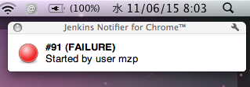
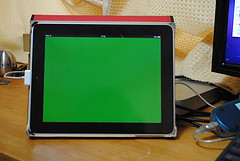

This plugin notifies build results via Websocket.

[[WebsocketPlugin-Features]]
== *Features*

* Notify build result via Websocket
* If you use modern web browser (e.g. Chrome, Firefox, Safari), you
receive realtime build result by Javascript. It includes iPhone/iPad.
* Offcourse, websocket is independent from browser. You could your
favorite laungage to receive realtime build result.

[[WebsocketPlugin-Setup]]
== *Setup*

At Manege Jenkins > Configure System > Websocket Notifier, you could
configure websocket port.

[.confluence-embedded-file-wrapper]##

At (your project) > Configure > Post build Actions, you could enable
websokcet notification.

[.confluence-embedded-file-wrapper]##

[[WebsocketPlugin-UsageExample]]
== *Usage Example*

[[WebsocketPlugin-ChromeExtension]]
=== *Chrome Extension*

https://chrome.google.com/webstore/developer/detail/mnjbjjllbclkpnebaddhkoonjelmiekm[Jenkins
Notifier for Chrome] supports websocket. So you could receive a
notification in realtime.

[.confluence-embedded-file-wrapper]##

[[WebsocketPlugin-iPad/iPhoneasXFD]]
=== *iPad/iPhone as XFD*

If you upload
https://github.com/jenkinsci/websocket-plugin/blob/master/xfd.html at
same host as jenkins, you could use iPhone/iPad as XFD.

[.confluence-embedded-file-wrapper]##

[[WebsocketPlugin-Windowsclient]]
=== Windows client

http://d.hatena.ne.jp/griefworker/20110928/jenkins_web_socket_notifier_client

[.confluence-embedded-file-wrapper]#image:http://cdn-ak.f.st-hatena.com/images/fotolife/g/griefworker/20110928/20110928194148.jpg[image]#

[[WebsocketPlugin-VersionHistory]]
== Version History

[[WebsocketPlugin-Version1.0.6(26July,2013)]]
=== *Version 1.0.6 (26 July, 2013)*

* Added: "Enable Websocket pings to keep connections alive" option
* Added: "Use status format" option
* Updated: webbit version (0.4.7 -> 0.4.15)

[[WebsocketPlugin-Version1.0.4(16April,2012)]]
=== *Version 1.0.4 (16 April, 2012)*

* Fixed: configurations were not loaded
* Updated: webbit version (0.3.0 -> 0.4.7)

[[WebsocketPlugin-Version1.0(6June,2011)]]
=== *Version 1.0 (6 June, 2011)*

* Initial release
