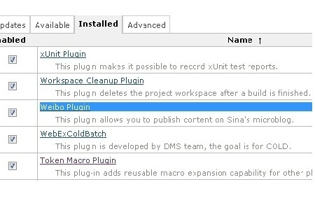
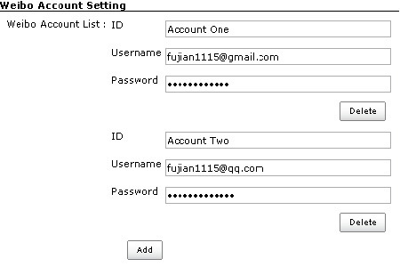
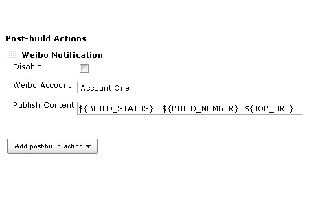

[.conf-macro .output-inline]##

[cols="",options="header",]
|===
|Plugin Information
|View Weibo https://plugins.jenkins.io/weibo[on the plugin site] for
more information.
|===

[.aui-icon .aui-icon-small .aui-iconfont-error .confluence-information-macro-icon]##

The current version of this plugin may not be safe to use. Please review
the following warnings before use:

* https://jenkins.io/security/advisory/2019-12-17/#SECURITY-1597[Credentials
stored in plain text]

 +

This plugin allow you to post customized message to Sina microblog.

*Introduce*

The content which be published to Sina microblog can contain customized
content which supports environment vars and some customized vars, such
as BUILD_STATUS. if the content contain DEFAULT_CONTENT,, it will be
replaced with BUILD_STATUS-JOB_NAME:BUILD_NUMBER-JOB_URL.

Demo site can check the http://weibo.com/jenkinsplugin[URL].

Any issues you can contact with author: fujian1115@gmail.com or
http://www.weibo.com/fujianthinking[Sina microblog].

All versions can check the
http://maven.jenkins-ci.org:8081/content/repositories/releases/org/jenkins-ci/plugins/weibo[Maven
Repo].

*Setup*

The Weibo plugin depends on
the https://wiki.jenkins-ci.org/display/JENKINS/Token+Macro+Plugin[Token-Macro-Plugin],you
should setup the plugin before using Weibo plugin.

*Usage*

[.confluence-embedded-file-wrapper]##

[.confluence-embedded-file-wrapper]##

[.confluence-embedded-file-wrapper]##

[.confluence-embedded-file-wrapper]##

[[WeiboPlugin-VersionHistory]]
== *Version History*

[[WeiboPlugin-Version1.0.1(Oct19,2013)]]
=== Version 1.0.1 (Oct 19, 2013)

* change artifact from weibo4jenkins to weibo

[[WeiboPlugin-Version1.0.0(Oct17,2013)]]
=== Version 1.0.0 (Oct 17, 2013)

* Initial release
