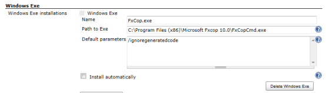
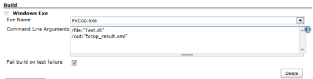

This plug-in is used to run the Windows Exe.

[[WindowsExeRunnerPlugin-Description]]
== Description

This plug-in is used to run the Windows Exe.

[[WindowsExeRunnerPlugin-Configuration]]
== Configuration

[[WindowsExeRunnerPlugin-Systemconfiguration]]
=== System configuration

[.confluence-embedded-file-wrapper]##

. Open the system configuration page "Manage Jenkins->Configure system"
. Enter the path to the Windows exe, that should be used by Jenkins.

[[WindowsExeRunnerPlugin-Jobconfiguration]]
=== Job configuration

[.confluence-embedded-file-wrapper]##

[cols=",",options="header",]
|===
|name |description
|Exe Name |Select Windows Exe.

|Command Line Arguments |You can specify multiple command line arguments
by separating them with new-line or space.

|Fail build on test failure |Fail build on test failure.
|===

[[WindowsExeRunnerPlugin-Changelog]]
== Changelog

[[WindowsExeRunnerPlugin-Version1.3(11/01/2018)]]
=== Version 1.3 (11/01/2018)

Supports https://wiki.jenkins-ci.org/display/JENKINS/Token+Macro+Plugin[Token
Macro Plugin]

Works with Pipeline

[[WindowsExeRunnerPlugin-Version1.2(08/19/2013)]]
=== Version 1.2 (08/19/2013)

Support
https://wiki.jenkins-ci.org/display/JENKINS/Promoted+Builds+Plugin[Promoted
Builds Plugin].

[[WindowsExeRunnerPlugin-Version1.1(04/06/2013)]]
=== Version 1.1 (04/06/2013)

Add index.jelly.

[[WindowsExeRunnerPlugin-Version1.0(03/26/2013)]]
=== Version 1.0 (03/26/2013)

Initial release.
