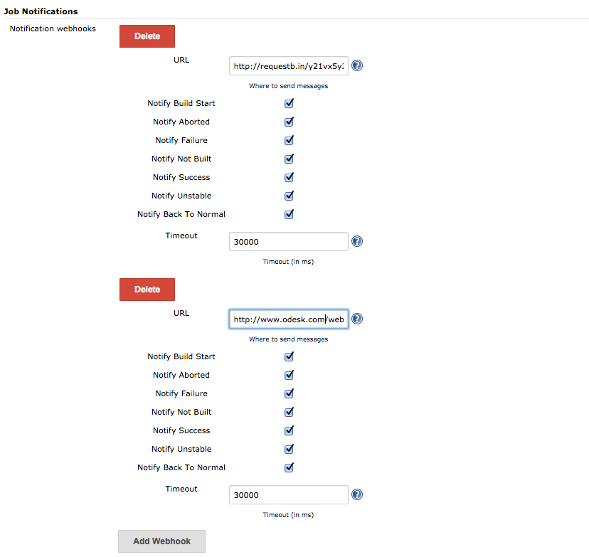

[.conf-macro .output-inline]#This plugin allows to send build status
related notifications to http://www.upwork.com/[Upwork] workplace
messaging system in the form of webhooks.# +
Once the workplace notifier plugins is installed, webhooks for
notifications are defined in *Job Notification* section of the
configuration of job. Here is the screenshot for that section
[.confluence-embedded-file-wrapper]## +
Here are the steps to configure a webhook

* Click on the "Add Webhook" button.
* Enter the webhook URL where you want to send the notification message.
* Check the boxes for which you want to receive notifications.
* Configure the timeout after which jenkins plugin would give on
unavailable server.

Once you configure this plugin, build related messages will appear in
the workplace messaging system.
