 +

[[WorksoftExecutionManagerPlugin-Description]]
== Description

This is the official Worksoft Supported Plugin.  The plugin adds build
steps for interacting with a Worksoft's Execution Manager to run your
Certify processes or ALM labs.

[[WorksoftExecutionManagerPlugin-Installation]]
== Installation

*Note*: This plugin requires Worksoft's Execution Manager version
10.0.20 or later.  If you use an earlier version of Execution Manager
you will see a runtime error 405 Method Not Allowed.

[[WorksoftExecutionManagerPlugin-UpdateCenter]]
=== Update Center

. Open Jenkins in a browser (e.g. http://<__jenkins-host__>:8080)
. Navigate to *Manage Jenkins → Manage Plugins* view
. Under the *Available* tab find the _Worksoft Execution Manager_ plugin
and check the box adjacent to the plugin and click *Install without
restart*:

 +

[.confluence-embedded-file-wrapper]#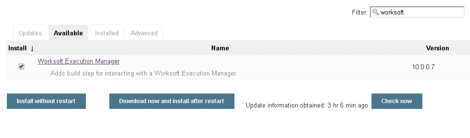#

[[WorksoftExecutionManagerPlugin-Manual]]
=== Manual

. Download *ws-execution-manager.hpi*
from https://plugins.jenkins.io/ws-execution-manager
. Open Jenkins in a browser (e.g. http://<__jenkins-host__>:8080)
. Navigate to *Manage Jenkins* → *Manage Plugins* and select the
*Advanced* tab.
. Click the **Choose File **button in the *Upload Plugin* section.
. Find the location of the *ws-execution-manager.hpi* file and click the
*Open* button and *Upload* the file.
. Restart Jenkins, if necessary.

[[WorksoftExecutionManagerPlugin-Usage]]
== Usage

[[WorksoftExecutionManagerPlugin-ConfigureGlobalWorksoftExecutionManagerSettings]]
=== Configure Global Worksoft Execution Manager Settings

The plugin provides a means to configure an Execution Manager's URL and
credentials used by all Execution Manager build steps (unless
overridden). To configure this, navigate to _Jenkins global
configuration settings and paths_ (Jenkins → Manage Jenkins → Configure
System) and locate the *Global Worksoft Execution Manager Settings*
section:

[.confluence-embedded-file-wrapper .confluence-embedded-manual-size]#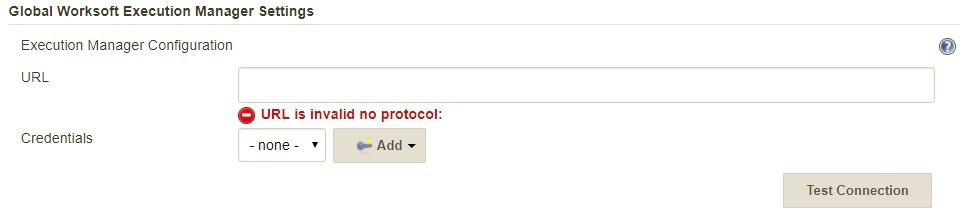#

Configure the URL of the Execution Manager (typically
http://<em-host>/executionmanager):

[.confluence-embedded-file-wrapper .confluence-embedded-manual-size]#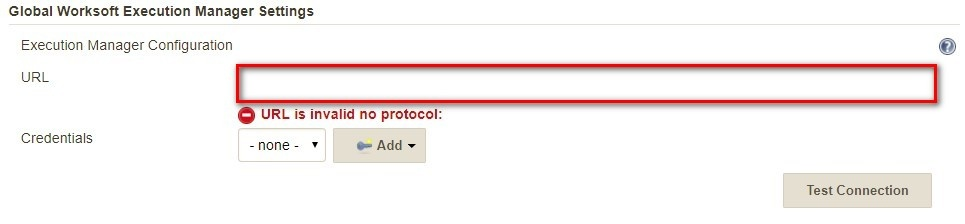#

And credentials:

[.confluence-embedded-file-wrapper .confluence-embedded-manual-size]#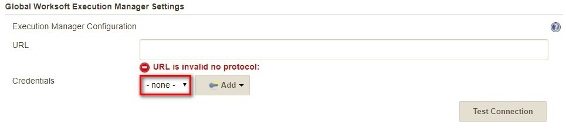#

Save these configuration settings after which they can be used by
Execution Manager build steps (Freestyle and Pipeline).

[[WorksoftExecutionManagerPlugin-FreestyleProject]]
=== Freestyle Project

Create a Freestyle project and add the *Run Execution Manager
Request* build step: 

[.confluence-embedded-file-wrapper .confluence-embedded-manual-size]#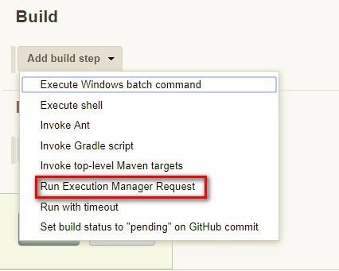#

Select the type of request to execute:

[.confluence-embedded-file-wrapper .confluence-embedded-manual-size]#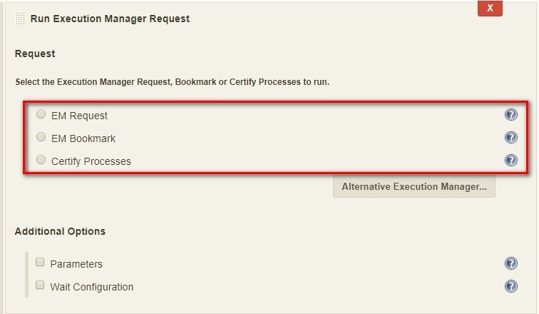#

[[WorksoftExecutionManagerPlugin-ExecutionManagerRequest]]
==== Execution Manager Request

Select *EM Request* to run a predefined request configured on the
Execution Manager. The *Name* list box will be populated with all
available requests of which one must be selected.

[.confluence-embedded-file-wrapper .confluence-embedded-manual-size]#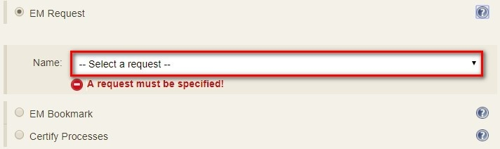#

[[WorksoftExecutionManagerPlugin-ExecutionManagerBookmark]]
==== Execution Manager Bookmark

Select *EM Bookmark* to run a predefined bookmark configured on the
Execution Manager via the Management Studio. The *Name* list box will be
populated with all available bookmarks of which one must be selected.

[.confluence-embedded-file-wrapper .confluence-embedded-manual-size]#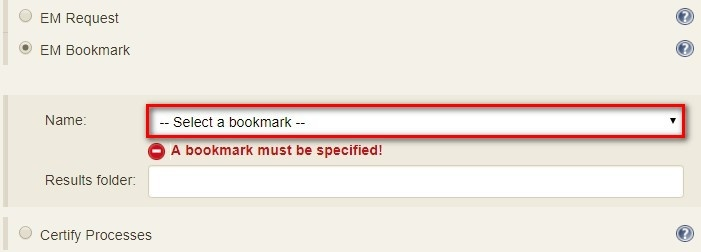#

Optionally, a result folder can be specified by filling in the *Results
folder* text box:

[.confluence-embedded-file-wrapper .confluence-embedded-manual-size]#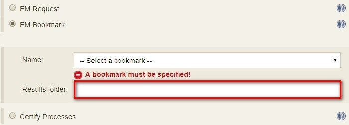#

[[WorksoftExecutionManagerPlugin-CertifyProcesses]]
==== Certify Processes

Select *Certify Processes* to execute a list of Certify processes
without creating a request or bookmark first.

[[WorksoftExecutionManagerPlugin-]]
=== [.confluence-embedded-file-wrapper .confluence-embedded-manual-size]#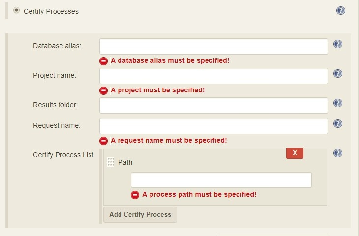#

Provide an database alias name of the Certify connection saved in
Management Studio -> Configuration -> Certify Configuration:

[.confluence-embedded-file-wrapper .confluence-embedded-manual-size]#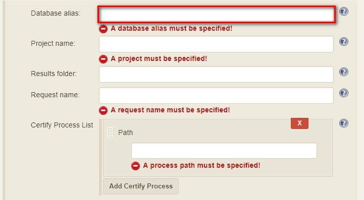#

Specify the Certify project where processes reside:

[.confluence-embedded-file-wrapper .confluence-embedded-manual-size]#image:docs/images/BuildStepCfg8.jpg[image,height=400]#

Optionally, specify a folder where Certify Results will be saved. If not
specified, results go to the root results folder:

[.confluence-embedded-file-wrapper .confluence-embedded-manual-size]#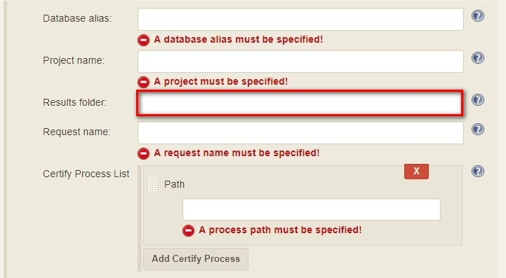#

Specify a name to be given to the request execution:

[.confluence-embedded-file-wrapper .confluence-embedded-manual-size]#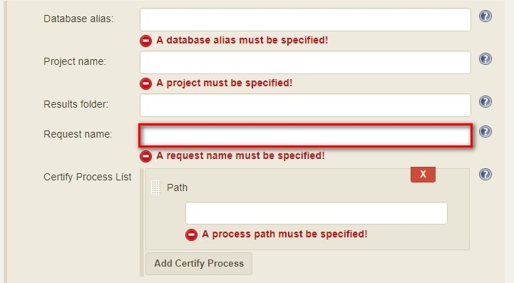#

Provide a fully qualified path to each process to execute:

[.confluence-embedded-file-wrapper .confluence-embedded-manual-size]#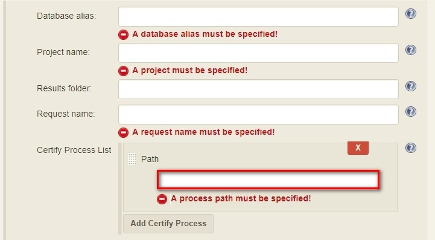#

Add additional processes by clicking the Add Certify Process button:

[.confluence-embedded-file-wrapper .confluence-embedded-manual-size]#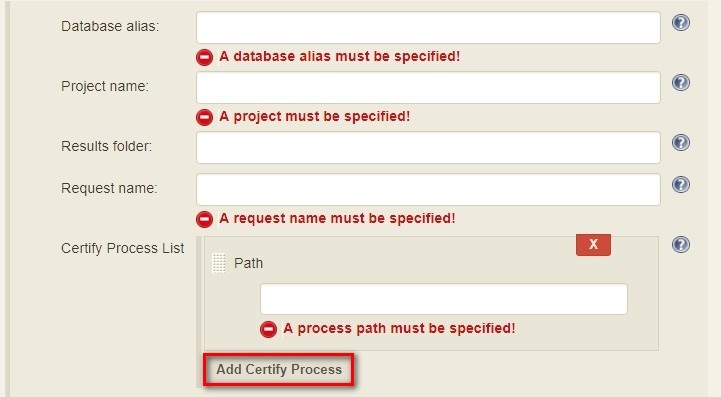#

[[WorksoftExecutionManagerPlugin-ConfigureAlternativeExecutionManager]]
==== Configure Alternative Execution Manager

An Execution Manager build step can override the globally Execution
Manager configuration (see above) by configuring an alternative:

[.confluence-embedded-file-wrapper .confluence-embedded-manual-size]##

Configure the URL of the Execution Manager (typically
http://<em-host>/executionmanager):

[.confluence-embedded-file-wrapper .confluence-embedded-manual-size]#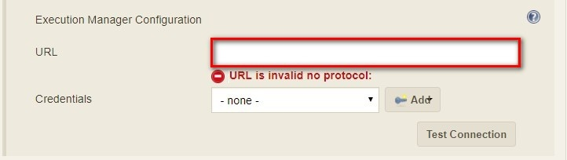#

And credentials:

[.confluence-embedded-file-wrapper .confluence-embedded-manual-size]#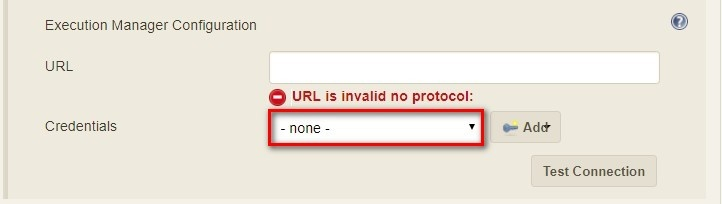#

[[WorksoftExecutionManagerPlugin-AdditionalOptions]]
==== Additional Options

Each request type (request, bookmark and processes) can be configured to
be executed with additional Certify parameters and wait configuration:

[.confluence-embedded-file-wrapper .confluence-embedded-manual-size]#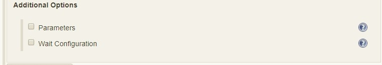#

[[WorksoftExecutionManagerPlugin-CertifyParameters]]
===== Certify Parameters

Optionally, Certify parameters can be specified. Both a key and value
must be specified. The value can refer to Jenkins environment variables
using this syntax - **$\{**__JENKINS_ENV_VAR__*}*. For example -
*$\{BUILD_ID}*:

[.confluence-embedded-file-wrapper .confluence-embedded-manual-size]#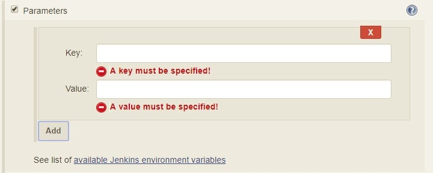#

Optionally, execution wait configuration can be specified. Both the
polling interval and maximum run time must be specified in seconds:

[.confluence-embedded-file-wrapper .confluence-embedded-manual-size]#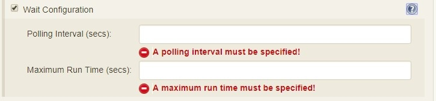#

....
....

[[WorksoftExecutionManagerPlugin-Output]]
=== Output

Plugin version 10.0.1 and later outputs the Worksoft Execution Manager
result set in JSON format to a file named - *execMan-result.json* - in
the associated Jenkins job's workspace directory. For example:

....
    {
        "Status": "Completed",
        "Description": "FAILED",
        "ExecutionStatus": "FAILED",
        "Tasks": [
            {
                "Name": "test login",
                "ExecutionStatus": "Failed",
                "ResourceName": "CKAgentBox1",
                "LastReportedError": "",
                "Status": "Completed",
                "CertifyDatabaseAliasName": "CK_Certify",
                "CertifyResultID": 20075
            }
        ]
    }
....

**Note: **See Certify Execution Manager's API specification for a
complete description of the result set.

This file can be read/processed in either a freestyle or pipeline job.
For example, in a freestyle job, to retrieve from Certify the failed
test steps, add a Groovy build step with Groovy code like:

....
    // Requires Groovy plugin - http://wiki.jenkins-ci.org/display/JENKINS/Groovy+plugin
    import groovy.json.JsonSlurper
    import groovy.json.JsonOutput
    import hudson.*
    import hudson.model.*
    import java.lang.*
      
    def build = Thread.currentThread().executable
    def resolver = build.buildVariableResolver
    def workspace = build.getModuleRoot().absolutize().toString()
    
    // Retrieve job paramaters
    def API_TOKEN = resolver.resolve("API_TOKEN")
    def API_URL = resolver.resolve("API_URL")
    
    def execManResult = new FilePath(build.getModuleRoot().getChannel(), workspace + "/execMan-result.json")
    if (execManResult.exists()) {
        def result = new JsonSlurper().parse(execManResult.read())
        println "result=" + JsonOutput.prettyPrint(JsonOutput.toJson(result))
    
        // Loop through all tasks looking for failed tasks and their result ID
        for(int i=0; i < result['Tasks'].size(); i++) {
            def logHeaderID = result['Tasks'][i]['CertifyResultID']
            def executionStatus = result['Tasks'][i]['ExecutionStatus']
            if (logHeaderID != null && executionStatus.toUpperCase().equals("FAILED")) {
                // Retrieve failed test steps from Certify and display them
                def url = API_URL + "?logHeaderID=" + logHeaderID
                def api = url.toURL().openConnection()
                api.addRequestProperty("Accept", "application/json")
                api.addRequestProperty("token", API_TOKEN)
                api.setRequestMethod("GET")
                api.connect()
    
               println "Tasks[" + i +"] logHeaderID=" + logHeaderID + ":" +  JsonOutput.prettyPrint(api.content.text)
            }
        } 
    }
....

Similarly, a pipeline job could process the output file as follows:

....
    // Requires the following In-Process script approvals:
    //    method java.net.HttpURLConnection setRequestMethod java.lang.String
    //    method java.net.URL openConnection
    //    method java.net.URLConnection addRequestProperty java.lang.String java.lang.String
    //    method java.net.URLConnection connect
    //    method java.net.URLConnection getContent
    //    staticMethod org.codehaus.groovy.runtime.DefaultGroovyMethods getText java.io.InputStream
    //    staticMethod org.codehaus.groovy.runtime.DefaultGroovyMethods hasProperty java.lang.Object java.lang.String
    //    staticMethod org.codehaus.groovy.runtime.DefaultGroovyMethods toURL java.lang.String
    
    import groovy.json.JsonOutput
    
    pipeline {
        agent {
            node {
                label "master"
            }
        }
        stages {
            stage('build') {
                steps {
                    // Execute an Execution Manager request
                    execMan request: [name: '<an-execution-manager-request-name>'], requestType: 'request'
                    script {
                        if (fileExists('execMan-result.json')) {
                            def result = readJSON file: 'execMan-result.json'
                            echo "result=" + JsonOutput.prettyPrint(JsonOutput.toJson(result))
    
                            for(int i=0; i < result['Tasks'].size(); i++) {
                                def logHeaderID = result['Tasks'][i]['CertifyResultID']
                                def executionStatus = result['Tasks'][i]['ExecutionStatus']
                                if (logHeaderID != null && executionStatus.toUpperCase().equals("FAILED")) {
                                    // Retrieve failed test steps from Certify and display them
                                    def url = API_URL + "?logHeaderID=" + logHeaderID
                                    def api = url.toURL().openConnection()
                                    api.addRequestProperty("Accept", "application/json")
                                    api.addRequestProperty("token", API_TOKEN)
                                    api.setRequestMethod("GET")
                                    api.connect()
    
                                    echo "Tasks[" + i +"] logHeaderID=" + logHeaderID + ":" + JsonOutput.prettyPrint(api.content.text)
                                }
                            }
                        }
                    }
                }
            }
        }
    }
....

[[WorksoftExecutionManagerPlugin-Pipeline]]
=== Pipeline

[[WorksoftExecutionManagerPlugin-DSLReference-execMan:RunExecutionManagerRequest]]
==== DSL Reference - *_execMan: Run Execution Manager Request_*

*requestType*

*Type:* String

 +

*altEMConfig* (optional)

| Optional alternative Execution Manager configuration. If provided,
these parameters override those specified in Jenkins global
configuration.

Nested object:

*url*

*Type*: String

*credentials*

*Type*: String

* +
*

*bookmark *(optional)

| Select this to run a predefined bookmark configured on the Execution
Manager via the Management Studio.

Nested object:

*name*

*Type*: String

*folder *(optional)

*Type*: String

* +
*

*execParms *(optional)

| Optional execution request parameters. Both a key and value must be
specified. The value can refer to Jenkins environment variables using
this syntax - **$\{**__JENKINS_ENV_VAR__**}**. For example -
**$\{BUILD_ID}**.

*list* (optional)

*Type*: _ArrayList_ of emParam

*key*

*Type*: String

*value*

*Type*: String

* +
*

*processList *(optional)

| Select this to execute a list of Certify processes without creating a
request or bookmark first.

Nested object:

*database*

| Alias name of the Certify connection saved in Management Studio ->
Configuration -> Certify Configuration.

*Type*: String

 +

*project*

| Certify project where processes reside.

*Type*: String

 +

*processes*

| List of the fully qualified path to each process.

_*Type*: ArrayList_ of certifyProcess

*processPath*

*Type*: String

 +

*folder*

| Folder where Certify Results will be saved. If not specified, results
go to the root results folder.

*Type*: String

 +

*requestName*

| Name given to the request execution.

*Type*: String

* +
*

*request *(optional)

| Select this to run a predefined request configured on the Execution
Manager.

*name*

*Type*: String

 +

*waitConfig *(optional)

| Optional execution request wait configuration. Both the polling
interval and maximum run time must be specified in seconds

Nested object:

*pollInterval*

*Type*: String

*maxRunTime*

*Type*: String

[[WorksoftExecutionManagerPlugin-Examplepipelinesnippets]]
==== Example pipeline snippets

Simple Request execution:

execMan request: [name: '_name-of-request_'], requestType: 'request'

Simple Bookmark execution:

execMan bookmark: [folder: '_result-folder-name_', name:
'_name-of-bookmark_'], requestType: 'bookmark'

Simple Process List execution:

execMan processList: [database: '_database-alias_', folder:
'_result-folder-name_', processes: [[processPath:
'_Project1\\Folder1\\Folder2\\Process1_'], [processPath:
'_testproject\\testfolder\\testprocess_']], project:
'_certify-project-name_', requestName: '_request-name_'], requestType:
'processList'

Bookmark request with wait config specified:

execMan bookmark: [folder: '_result-folder-name_', name:
'_name-of-bookmark_'], requestType: 'bookmark', waitConfig: [maxRunTime:
'_600_', pollInterval: '_10_']

Request with Parameters:

execMan request: [name: '_name-of-request_'], requestType: 'request',
execParams: [list: [[key: '_key1-name_', value: '_value1_'], [key:
'_key2-name_', value: '_value2_']]]

[[WorksoftExecutionManagerPlugin-Changelog]]
== Changelog

[[WorksoftExecutionManagerPlugin-Version10.0.0.7(Dec112018)]]
=== Version 10.0.0.7 (Dec 11 2018)

* Initial version

[[WorksoftExecutionManagerPlugin-Version10.0.1.19(April242019)]]
=== Version 10.0.1.19 (April 24 2019)

* Output Certify Execution Manager result set to
__<workspace-path>__**_/execMan-result.json_**

[[WorksoftExecutionManagerPlugin-Version10.0.2.27(August162019)]]
=== Version 10.0.2.27 (August 16 2019)

* Fix problem writing to
__<workspace-path>__**_/execMan-result.json _**on slave nodes

 +
