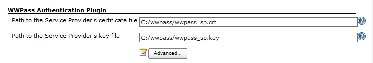
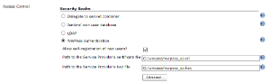
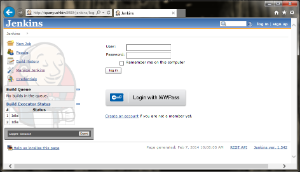
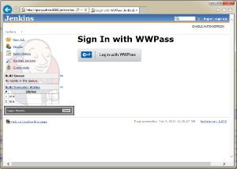
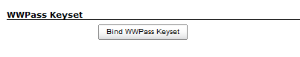
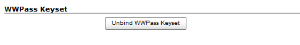

[[WWPassAuthenticationPlugin-WWPassAuthenticationPluginforJenkinsCI]]
== WWPass Authentication Plugin for Jenkins CI

'''''

Plugin for Jenkins CI implements authentication via WWPass Keyset. This
plugin may used as primary security realm or as federated login service.

[[WWPassAuthenticationPlugin-Pluginsetup]]
=== Plugin setup

First, you need to register at https://developers.wwpass.com/ and get a
Service Provider's personal certificate and key pair.

Plugin searches the certificate-key pair on the following paths by
default:

[cols=",,",]
|===
|  |Windows |Linux
|Certificate file |C:/wwpass/wwpass_sp.crt |/etc/ssl/certs/wwpass_sp.crt
|Key file |C:/wwpass/wwpass_sp.key |/etc/ssl/certs/wwpass_sp.key
|===

You may use this paths and names. If you want to use other paths and
names for these files, change it in Jenkins settings:

* if you use WWPass authentication as a secondary realm, change these
properties in **Manage Jenkins>Configure System**:

[.confluence-embedded-file-wrapper]##

* or if you use it as a primary realm - in **Manage Jenkins>Configure
Global Security**):

[.confluence-embedded-file-wrapper]##

After that, you'll get "Login with WWPass" on the login screen.

Federated login service:
[.confluence-embedded-file-wrapper]##

Primary security realm:
[.confluence-embedded-file-wrapper]##

If you will use WWPass Authentication Plugin as a federated login
service, every user may bind/unbind WWPass Key to his account by
pressing the bind/unbind button on the User_name>Configure screen:

[.confluence-embedded-file-wrapper]##
[.confluence-embedded-file-wrapper]##
