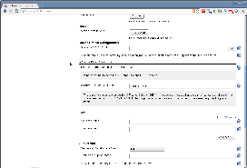
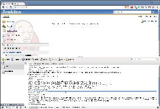

[[XFrameFilterPlugin-XFrameFilterPlugin]]
== XFrame Filter Plugin

 +

Provides a very simple filter which adds a response header indicating
how frame/iframe requests should be handled.

 +

The
https://developer.mozilla.org/en/The_X-FRAME-OPTIONS_response_header[X-Frame-Options
HTTP response header] can be used to indicate whether or not a browser
should be allowed to render a page in a frame or iframe. Sites can use
this to avoid clickjacking attacks, by ensuring that their content is
not embedded into other sites.

 +

[cols=",",options="header",]
|===
|Configuration |X-Frame-Options Header
|[.confluence-embedded-file-wrapper]##
|[.confluence-embedded-file-wrapper]##
|===

 +

'''''

 +

[[XFrameFilterPlugin-Changelog]]
=== Changelog

[[XFrameFilterPlugin-1.2(Jun302014)]]
==== 1.2 (Jun 30 2014)

* https://issues.jenkins-ci.org/browse/JENKINS-23105[JENKINS-23105]
Plugin description broke display of Plugin Manager.
* https://issues.jenkins-ci.org/browse/JENKINS-22430[JENKINS-22430]
Settings not loaded after restart.

[[XFrameFilterPlugin-1.1(Feb212014)]]
==== 1.1 (Feb 21 2014)

* https://issues.jenkins-ci.org/browse/JENKINS-21881[JENKINS-21881] Work
with 1.532.2+ and 1.551+, also offering a way of _disabling_ the header
in those versions.

[[XFrameFilterPlugin-1.0(released2011-09-27)]]
==== 1.0 (released 2011-09-27)

* initial implementation
* fully I18N
