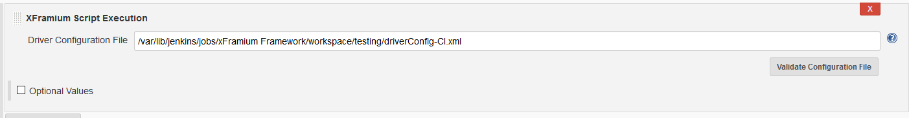
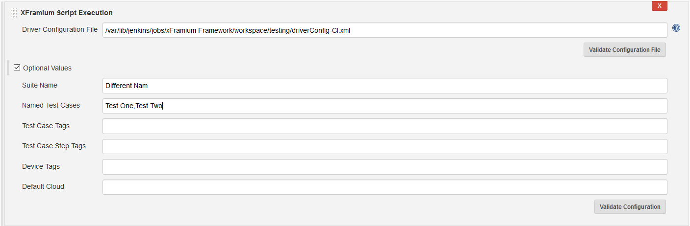
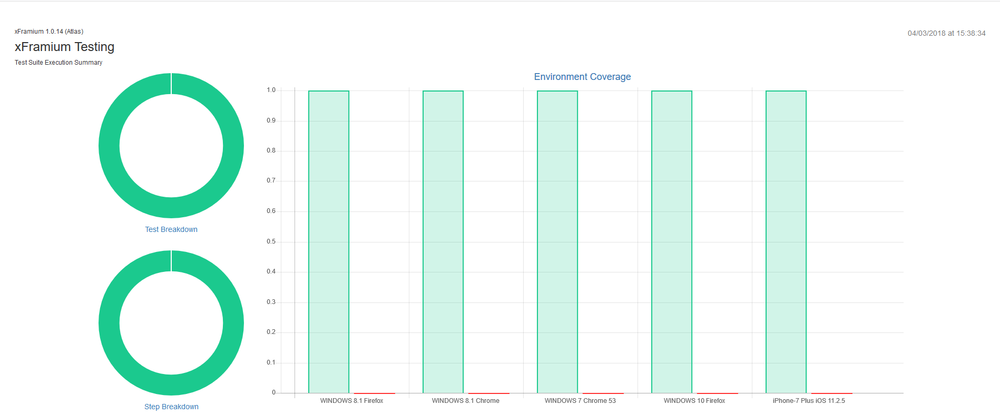

 

The xFramium Platform plugin allows users to execute xFramium scripts
inside of Jenkins and view reports.  Users can simply specify and
validate their driver configuration file

[.confluence-embedded-file-wrapper .confluence-embedded-manual-size]##

Or they can modify the execute parameters to override the suite name,
specify test cases and tags or specify devices and clouds.

[.confluence-embedded-file-wrapper .confluence-embedded-manual-size]##

 

View the xFramium reports directly from Jenkins

 

[.confluence-embedded-file-wrapper .confluence-embedded-manual-size]##

 
