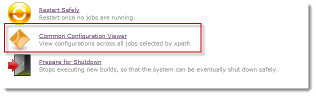
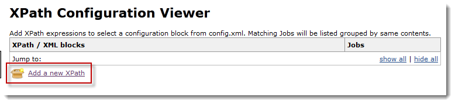
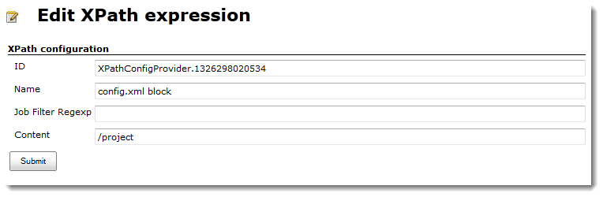
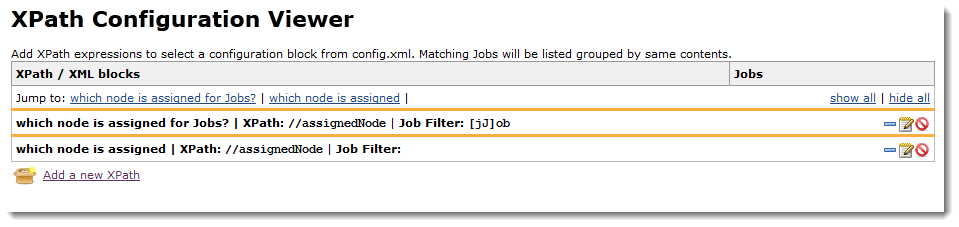
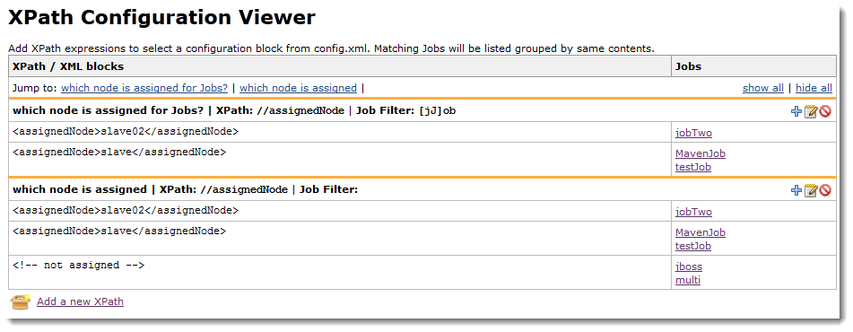

This plugin adds a new link "XPath Configuration Viewer" to the Jenkins
Managagement page. It provides a simple and easy way to check job
configurations having a huge number of jobs.

[[XPathConfigurationViewer-General]]
== General

Do you habe more than 50 jenkins jobs to administrate? Do you use
several plugins that have all individual entries in the job's config.xml
files? Than this plugin can help you a lot.

It takes the idea of the
https://wiki.jenkins-ci.org/display/JENKINS/Configuration+Slicing+Plugin[configuration
slicing plugin] using a more generic approach. XPath expressions are
used to filter all jobs, that match to it. The resulting table shows all
variations of the XPath-selected XML-snippets in the left column. The
right column shows for each XML-snippet all jobs having this exact
XML-snippet. +
In this way, it is easy to see, if a job is missing or missplaced in a
list of jobs for an XML-snippet. +
Each job title is directly linked to it's configuration page.

[[XPathConfigurationViewer-Howtouse]]
== How to use

*The XPath Configuration Viewer plugin can only be used by users with
adminstrator rights!*

The plugin integrates in the list of management links on the
`+.../manage+` page.

[.confluence-embedded-file-wrapper]##

Clicking on the link leads to the following page: +
[.confluence-embedded-file-wrapper]##

It shows a table with two columns. The left column for the XML-snippets
and the right column for the jobs having this snippet.

Clicking on the "Add a new XPath"-link opens this dialog: +
[.confluence-embedded-file-wrapper]##

It has 4 fields:

[cols=",,",options="header",]
|===
|field |function |sample
|ID |internal ID of the XPath expression
|`+XPathConfigProvider.1326298020534+`

|Name |Name for the XPath expression that describes, what to look for
|which node is assigned?

|Job Filter Regexp |Regular expression to filter the jobs by their names
|`+^.+``+MyJob-.+``+$+`

|Content |XPath expression to select an XML-snippet from the jobs
config.xml files |`+//assignedNode+`
|===

On saving the new XPath configuration, it is stored into an XML file in
the jenkinshome directory using the
org.jenkins-ci.lib::config-provider-model::1.1.

The XPath Configuration Viewer shows something like the following: +
[.confluence-embedded-file-wrapper]##

All configured XPath expressions are listed in a collapsed table. The
results of each expression can be opened by clicking on the plus sign on
the right side in the table row. The other two signs are for editing and
deleting of the row.

In the title row, all configured XPath expressions are listed by their
names. These are ancor links to jump directly down the page to the
corresponding block. With the two links right of this list it is
possible to open and close all rows at once. +
[.confluence-embedded-file-wrapper]##

Jobs not matching to an XPath expression are listed as last row of a
configuration block.

Using the link behind the job names leads to the corresponding job
configuration page.

[[XPathConfigurationViewer-Versionhistory]]
== Version history

[[XPathConfigurationViewer-1.1.1(May21,2012)]]
=== 1.1.1 (May 21, 2012)

* Changed XPath result output to show all matches if expression selects
multiple config nodes.

[[XPathConfigurationViewer-1.1.0(Mar07,2012)]]
=== 1.1.0 (Mar 07, 2012)

* Added a comparator to order the configs by their ids. Now they keep
the order in which they are created.

[[XPathConfigurationViewer-1.0.8(Jan31,2012)]]
=== 1.0.8 (Jan 31, 2012)

* In respect to Ullrich Hafners email of Jan 31, 2012 "Plug-in should
not depend on jenkins-co​re > LTS version" I downgraded the dependency
to 1.424.

[[XPathConfigurationViewer-1.0.6(Jan11,2012)]]
=== 1.0.6 (Jan 11, 2012)

* After a longer fight with maven, I finally managed to release the
plugin to the jenkins nexus.

[[XPathConfigurationViewer-1.0(Jan08,2012)]]
=== 1.0 (Jan 08, 2012)

* Plugin creation, initial checkin. Waiting for GIT integration...
