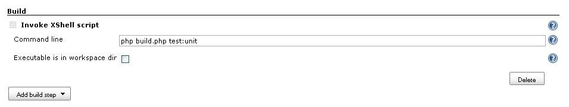

This plugin defines a new build type to execute a shell command in a
cross-platform environment.

[[XShellPlugin-Description]]
== Description

Cross platform shell executor.

Using Jenkins built-in "Execute Windows batch command" you can run
commands using the windows shell.

Using Jenkins built-in "Execute shell" you can run commands using unix
shell.

If you need to run a job cross platform you cannot use the two standard
executors provided by Jenkins. You need a "build step" that can be
executed both in Windows and in Unix.

This plugin does exactly this: it takes a command, as the two standard
build steps do, and executes it calling the correct shell depending on
the operating system running on the current job executor.

[[XShellPlugin-Whatitdoes...]]
== What it does...

* It runs any executable (with complete command line) available in the
system from current working dir (command must be in Path or in job's
workspace directory or subdirectory).
* Automatic conversion of file separator is done according to the
executing operating system.
* Variable style is converted according to the executing operating
system. E.g. `+$JOBPARAM1+` is converted to `+%JOBPARAM1%+` in the
command if the executing operating system is Windows.

Constraints:

* the current working directory of the command execution is always the
job's workspace root.
* ./ must not be included in command line (use the configuration switch
provided to specify that command is in current working dir or subdir).

Examples:

*Example 1: run executable + script with parameter*

Write your command in the *nix style:

[source,syntaxhighlighter-pre]
----
php scripts/build.php $JOBPARAM1
----

If the command runs on a *nix node, the command runs un-altered. If it
runs on a Windows node, it is changed to:

[source,syntaxhighlighter-pre]
----
php scripts\build.php %JOBPARAM1%
----

Note that the file separator and variable naming convention have
changed.

[[XShellPlugin-...andwhatitdoesnot!]]
== ... and what it does not!

[[XShellPlugin-Commandtranslationproblem]]
=== Command translation problem

[[XShellPlugin-Description.1]]
==== Description

It cannot translate any command! So you cannot write

[source,syntaxhighlighter-pre]
----
rm -rf bin
----

because on windows `+rm+` command is not available.

[[XShellPlugin-Solution]]
==== Solution

You can wrap your commands in two scripts, one for windows and one for
unix, each one calling the right command for the operating system:

*clean*

[source,syntaxhighlighter-pre]
----
rm -rf bin
----

*clean.bat*

[source,syntaxhighlighter-pre]
----
del /F /S bin
----

and then call `+clean+` using an XShell build step. +
This will execute `+clean+` in unix and `+clean.bat+` in windows.

[[XShellPlugin-Notes]]
== Notes

* in windows you can call clean and get clean.bat called, in unix you
can't (so the solutions above work);
* in unix you have to specify if the command is in the current working
dir (and if it is not available it will not be searched in PATH), in
windows you haven't to.

[[XShellPlugin-Buildstepconfiguration]]
== Build step configuration

To add a XShell build step

* click on the `+Add build step+` button and choose
`+Invoke XShell script+`;
* fill in the command line text;
* choose if the executable is in global Path or in workspace.

[.confluence-embedded-file-wrapper]##

[[XShellPlugin-TODO]]
== TODO

* Allow execution from a custom working dir (different from workspace
dir)
* Run executable from workspace directory (in unix must be written using
`+./+` form). DONE in 0.2
* Replace any '\' or '/' in the command line with File.separator
* Set environment variables... (see comments)

[[XShellPlugin-Versionhistory]]
== Version history

[[XShellPlugin-Version0.10(Dev)]]
=== Version 0.10 (Dev)

[[XShellPlugin-Version0.9(Nov10,2013)]]
=== Version 0.9 (Nov 10, 2013)

* Improved regular expression
(https://github.com/jenkinsci/xshell-plugin/pull/4[xshell-pluigin pull
#4 on github]) - Thanks to calarco (https://github.com/clalarco)

[[XShellPlugin-Version0.8(Apr11,2012)]]
=== Version 0.8 (Apr 11, 2012)

* Fixed parsing of file separator when URLs are present in the command
line (https://github.com/jenkinsci/xshell-plugin/pull/2[xshell-plugin
pull #2 on github]) -
http://issues.jenkins-ci.org/browse/JENKINS-13243[issue #13243] - Thanks
to davehunt (https://github.com/davehunt)
* Replaced dubug with logging on jenkins log - Thanks to davehunt
(https://github.com/davehunt)

[[XShellPlugin-Version0.7(Dec29,2011)]]
=== Version 0.7 (Dec 29, 2011)

* Added environment variable format conversion (e.g. $VAR to %VAR% for
Windows launcher) - Thanks to tclift (https://github.com/tclift)

[[XShellPlugin-Version0.6(Mar1,2011)]]
=== Version 0.6 (Mar 1, 2011)

* Updates for Jenkins

[[XShellPlugin-Version0.4(Sep22,2010)]]
=== Version 0.4 (Sep 22, 2010)

* Modified regex for path separator replacement that was causing an
exception
https://issues.jenkins-ci.org/browse/JENKINS-7538[JENKINS-7538]
* Added build variables to environment variables (as in
CommandInterpreter).

[[XShellPlugin-Version0.3(May18,2010)]]
=== Version 0.3 (May 18, 2010)

* Replace any '\' or '/' in the command line with correct file separator
(selected using OS where the task is executed).

[[XShellPlugin-Version0.2(Mar26,2010)]]
=== Version 0.2 (Mar 26, 2010)

* Run executable from workspace directory also in unix.

[[XShellPlugin-Version0.1(Mar25,2010)]]
=== Version 0.1 (Mar 25, 2010)

* Initial release
* Runs a single command line
