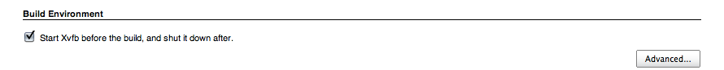
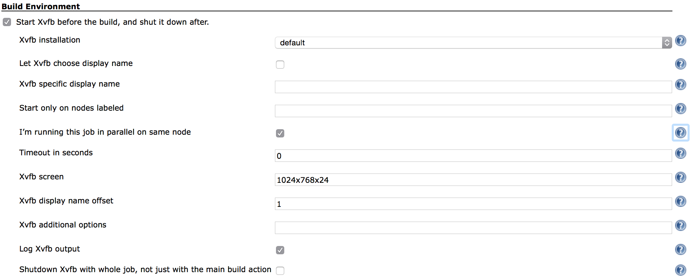
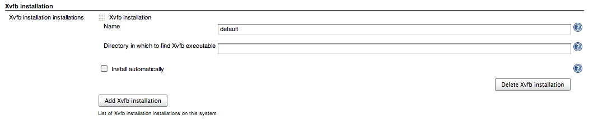

https://jenkins.ci.cloudbees.com/job/plugins/job/xvfb-plugin/badge/icon[[.confluence-embedded-file-wrapper]#image:https://jenkins.ci.cloudbees.com/job/plugins/job/xvfb-plugin/badge/icon[image]#]

[[XvfbPlugin-Whatisit?]]
== What is it?

[.conf-macro .output-inline]#Lets you
control http://www.x.org/archive/current/doc/man/man1/Xvfb.1.xhtml[Xvfb]
virtual frame buffer X11 server with each build. It starts Xvfb before
the build starts, and stops it with the build. This is very useful if
your build requires X11 access, for instance runs tests that require
GUI.#

New feature in version 1.1.0 - Jenkins Pipeline support

[.aui-icon .aui-icon-small .aui-iconfont-warning .confluence-information-macro-icon]#
#

With 1.1.0
https://wiki.jenkins-ci.org/display/JENKINS/Pipeline+Plugin[Pipeline]
support has landed, you can now use Xvfb to wrap other pipeline steps:

[source,syntaxhighlighter-pre]
----
node {
  wrap([$class: 'Xvfb']) {
    ... your steps here
  }
}
----

New feature in version 1.0.16 - Parallel build mode

[.aui-icon .aui-icon-small .aui-iconfont-warning .confluence-information-macro-icon]#
#

Use *I’m running this job in parallel on same node* when running
multiple slaves (Jenkins nodes) on the same machine to prevent
collisions when jobs are run on same-numbered executors.

New feature in version 1.0.11 - Labels

[.aui-icon .aui-icon-small .aui-iconfont-warning .confluence-information-macro-icon]#
#

Use *Start only on nodes labeled* option for multi platform builds.

New feature in version 1.0.9 - auto display name (on newer Xvfb
versions)

[.aui-icon .aui-icon-small .aui-iconfont-warning .confluence-information-macro-icon]#
#

Use *Let Xvfb choose display name* option with Xvfb that supports
*displayfd* option to choose the display number automatically by Xvfb.

[[XvfbPlugin-Gettinghelp]]
== Getting help

Please use the https://jenkins.io/mailing-lists/[users mailing list],
https://stackoverflow.com/questions/tagged/jenkins[Stackoverflow] or ask
on one of the https://jenkins.io/chat/[chats]. This page was not
designed for support, please do no comment on it asking for help. If you
encounter bugs or issues please create a ticket in the
https://issues.jenkins-ci.org/[issue tracker], it would be really nice
if you would research first and see if the issue you're experiencing is
due to the Xvfb Jenkins plugin or with the Xvfb itself and the version
of Xvfb you're using.

[[XvfbPlugin-Usage]]
== Usage

The plugin starts and stops the Xvfb virtual framebuffer X11 server so
your jobs can use X11 displays in headless environments such as servers,
or when dedicated X11 display is required for each job.

Start by going to _Manage Jenkins_ / _Global Tool Configuration_ on
Jenkins version 2.0 or _Manage Jenkins_ / _Configure System_ on earlier
version and setup your Xvfb installation. You need to give it a
arbitrary name like _default Xvfb_ and directory in which the Xvfb
executable is located like _/usr/X11R6/bin_. Unfortunately there is no
support for automatic installation of Xvfb. As of version 1.1.0 you can
define a single Xvfb tool installation or have a installation named
"default" and the jobs are going to run even if you don't define what
installation to use in the job configuration.

Typically you would use the defaults, which are that display numbers, a
unique number that is used to identify each X11 display (you might see
them shown as `+:0+`, `+:1+` or such), are based on the current Jenkins
executor number (the number you see next to the running job in the
_Build Executor Status_ box). This is fine if display numbers
corresponding to the executor numbers are available for Jenkins to use.
If they're not you have several options:

* use a fixed display number (_Xvfb specific display name_) by which you
guarantee that the specified display number is reserved for the
specified Jenkins job
* use display numbers based on executor numbers but offset by some
number (_Xvfb display name offset_) by which you reserve a range of
display numbers for the specified Jenkins job, for instance if you use
offset of 100, display names will be 100 and greater, up to the number
of executors on a particular Jenkins executor (i.e. slave or master
depending on where the job is run)
* leave the choice of display number to Xvfb (_Let Xvfb choose display
name_) – if your Xvfb version supports it, by which Xvfb chooses a free
display number on its own

[[XvfbPlugin-ProjectConfiguration]]
== Project Configuration

On the job configuration page, enable the "Start Xvfb before the build,
and shut it down after." under the Build Environment.
[.confluence-embedded-file-wrapper]##

If you want to customize defaults click on Advanced... button.

[.confluence-embedded-file-wrapper .confluence-embedded-manual-size]##

* *Xvfb installation* lets you choose Xvfb installation to use, these
are configured by the Jenkins administrator in the Tools section of
Jenkins configuration. By default the first defined installation is
used.
* *Let Xvfb choose display name* Uses the -displayfd option of Xvfb by
which it chooses its own display name by scanning for an available one.
This option requires a recent version of xserver, check your
installation for support. Useful if you do not want to manage display
number ranges but have the first free display number be used.
* *Xvfb specific display name* lets you customize what displayname
should be created, enter a number here and that number prefixed by :
will be the displayname (e.g. :1). If none is given display name is
based upon Jenkins executor number increased by 1, or the configurable
*Xvfb display name offset*.
* *I’m running this job in parallel on same node* - if you have multiple
slaves on the same machine, the build number will be generated based on
the ordinal of the machine multiplied by 100 plus the executor number
and any offset configured. Be careful Xvfb will not work with this
enabled if you're running more than 595 nodes and 35 executors per node.
* *Start only on nodes labeled* lets you specify via label expressions
on what node(s) to start Xvfb.
* *Timeout in seconds* lets you specify the number of seconds before
letting the build progress. Since Xvfb is started in background, certain
builds might fail because Xvfb was not started quick enough, with this
the build is paused the for specified seconds to let Xvfb startup. The
default is not to pause the build.
* *Xvfb screen* changes the screen resolution and pixel depth, it needs
to be in WxHxD format (i.e. 1600x1200x24). The default is 1024x768x24.
* *Xvfb display name offset* lets you specify a offset i.e. a number
that will be added to the job's executor number that will form the
display name used. This is handy if you run other X servers (Xvfb, Xvnc
or similar) in order to ensure that display numbers do not overlap.
* *Xvfb additional options* lets you specify any additional Xvfb command
line options you might need.
* *Log Xvfb output* redirects output of Xvfb into job log, useful if you
need to troubleshoot Xvfb starting/stopping.
* *Shutdown Xvfb with whole job, not just with the main build action*
keeps Xvfb running for post build steps.

[[XvfbPlugin-Jenkinsconfiguration]]
== Jenkins configuration

Jenkins administrator needs to define the Xvfb tool installation.
[.confluence-embedded-file-wrapper]##

The directory in which to find Xvfb executable can be left blank, then
PATH is searched to find the executable.

[[XvfbPlugin-VersionHistory]]
== Version History

[[XvfbPlugin-Version1.1.3(Mar20,2015)]]
=== *Version 1.1.3 (Mar 20, 2015)*

https://issues.jenkins-ci.org/browse/JENKINS-32039[JENKINS-32039]
"screen" default does not work +
https://issues.jenkins-ci.org/browse/JENKINS-33206[JENKINS-33206] Xvfb
plugin doesn't remember "Log Xvfb output" set via the configuration
page +
https://issues.jenkins-ci.org/browse/JENKINS-33288[JENKINS-33288] Xvfb
error does not fail build

Thanks to Mark Leaky, Nathan Smith and Francis De Brabandere for
reporting issues!

[[XvfbPlugin-Version1.1.2(Dec10,2015)]]
=== *Version 1.1.2 (Dec 10, 2015)*

https://issues.jenkins-ci.org/browse/JENKINS-32005[JENKINS-32005] Xfvb
plugin doesn't remember displayname set via the configuration page

Thanks to Adriaan Wisse for reporting the issue!

[[XvfbPlugin-Version1.1.1(Dec5,2015)]]
=== *Version 1.1.1 (Dec 5, 2015)*

https://github.com/jenkinsci/xvfb-plugin/pull/8[PULL#8] Screen name was
not being set from the configuration.

Thanks to Daniel Borges for the pull request!

[[XvfbPlugin-Version1.1.0(Nov24,2015)]]
=== *Version 1.1.0 (Nov 24, 2015)*

Added support for the
https://wiki.jenkins-ci.org/display/JENKINS/Pipeline+Plugin[Pipeline
Plugin]

[[XvfbPlugin-Version1.0.16(Feb8,2015)]]
=== *Version 1.0.16 (Feb 8, 2015)*

https://issues.jenkins-ci.org/browse/JENKINS-26848[JENKINS-26848] Does
not actually randomize DISPLAY

Thanks to Jo Shields for reporting and testing!

[[XvfbPlugin-Version1.0.15(Jan20,2015)]]
=== *Version 1.0.15 (Jan 20, 2015)*

https://issues.jenkins-ci.org/browse/JENKINS-26504[JENKINS-26504] Cannot
run low numbered builds with xvfb in Jenkins 1.597 +
https://issues.jenkins-ci.org/browse/JENKINS-26505[JENKINS-26505]
java.lang.IllegalArgumentException: Prefix string too short
org.jenkinsci.plugins.xvfb.XvfbBuildWrapper.launchXvfb(XvfbBuildWrapper.java:484)
https://wiki.jenkins-ci.org/display/JENKINS/Xvfb+Plugin#[duplicate]

Thanks to Jonathan Price and mturra for reporting the issue!

[[XvfbPlugin-Version1.0.13(Oct1,2014)]]
=== *Version 1.0.13 (Oct 1, 2014)*

https://github.com/jenkinsci/xvfb-plugin/pull/5[Prevent NPE when
NullConverter registered] pull request by
https://github.com/aleksz[Aleksandr Zhuikov]

Thanks to Aleksandr Zhuikov for the pull request!

[[XvfbPlugin-Version1.0.12(Jun2,2014)-bug-fixrelease]]
=== *Version 1.0.12 (Jun 2, 2014) - bug-fix release*

* https://issues.jenkins-ci.org/browse/JENKINS-23267[JENKINS-23267]
NullPointerException in XvfbBuildWrapper.setUp when configured without
node label restrictions

Thanks to Alexander Clausen, Jarosław Strzelecki & elygre for reporting
and suggesting fix.

[[XvfbPlugin-Version1.0.11(Jun1,2014)]]
=== *Version 1.0.11 (Jun 1, 2014)*

* https://issues.jenkins-ci.org/browse/JENKINS-23155[JENKINS-23155] Only
run plugin under Linux

Thanks to cowwoc for reporting and testing!

[[XvfbPlugin-Version1.0.10(Apr23,2014)]]
=== *Version 1.0.10 (Apr 23, 2014)*

* https://issues.jenkins-ci.org/browse/JENKINS-22719[JENKINS-22719] Xvfb
plugin does not start before release plugin
* Zombie slaying on Jenkins master failure

Thanks to Zoltan Nagy and Dmitry Katsubo for reporting and testing!

[[XvfbPlugin-Version1.0.9(Mar5,2014)]]
=== *Version 1.0.9 (Mar 5, 2014)*

* https://issues.jenkins-ci.org/browse/JENKINS-20758[JENKINS-20758] Xvfb
processes remain after slave disconnect
* https://issues.jenkins-ci.org/browse/JENKINS-19950[JENKINS-19950]
DISPLAY variable is not overwritten when it already exists
* https://issues.jenkins-ci.org/browse/JENKINS-21548[JENKINS-21548] Xvfb
failure does not fail build
* New feature that lets Xvfb to pick the display name

Thanks to Marc Günther, Richard Cross and Jonathan Rogers for reporting
and beta testing!

[[XvfbPlugin-Version1.0.8(Jun29,2013)]]
=== *Version 1.0.8 (Jun 29, 2013)*

* https://issues.jenkins-ci.org/browse/JENKINS-18094[JENKINS-18094] Xvfb
plugin doesn't write any error message in build log

Thanks to Aleksey Alekseev for reporting and testing!

[[XvfbPlugin-Version1.0.7(Dec9,2012)]]
=== *Version 1.0.7 (Dec 9, 2012)*

* https://issues.jenkins-ci.org/browse/JENKINS-15972[JENKINS-15972] No
display available in post build actions

Thanks to Yves Langisch for reporting the feature request!

[[XvfbPlugin-Version1.0.6(Nov5,2012)]]
=== *Version 1.0.6 (Nov 5, 2012)*

* https://issues.jenkins-ci.org/browse/JENKINS-15638[JENKINS-15638] Xvfb
'display name offset' defaults to 0, not 1 as described, if unset

Thanks to Fredrik Vihlborg for re-reporting issues!

[[XvfbPlugin-Version1.0.5(Oct30,2012)]]
=== *Version 1.0.5 (Oct 30, 2012)*

* https://issues.jenkins-ci.org/browse/JENKINS-15638[JENKINS-15638] Xvfb
'display name offset' defaults to 0, not 1 as described, if unset

Thanks to Fredrik Vihlborg for reporting issues!

[[XvfbPlugin-Version1.0.4(Oct24,2012)]]
=== *Version 1.0.4 (Oct 24, 2012)*

* https://issues.jenkins-ci.org/browse/JENKINS-14483[JENKINS-14483]
Remaining Xvfb processes in matrix jobs
* https://github.com/jenkinsci/xvfb-plugin/issues/2[pull request #2]
Make sure the random display name is always more than 0.
* https://issues.jenkins-ci.org/browse/JENKINS-15608[JENKINS-15608] Xvfb
'specific displayname' selects a random display between 0..100, not
1..100.

Thanks to Thorsten Kahler for reporting the issue and exemplary patience
in testing, https://github.com/JeroenVanHab[JeroenVanHab] for the pull
request and Fredrik Vihlborg for reporting the issue!

[[XvfbPlugin-Version1.0.3(Sep15,2012)]]
=== *Version 1.0.3 (Sep 15, 2012)*

* https://issues.jenkins-ci.org/browse/JENKINS-14790[JENKINS-14790]
NullPointerException starting Xvfb on remote slave
* https://issues.jenkins-ci.org/browse/JENKINS-15174[JENKINS-15174]
Timeout option not retrieved correctly

Thanks to Brian Sipos and Daniel Piorkowski for reporting issues!

[[XvfbPlugin-Version1.0.2(Mar12,2012)]]
=== Version 1.0.2 (Mar 12, 2012)

* Field to add additional options to Xvfb command line (JENKINS-13046)

[[XvfbPlugin-Version1.0.1(Jan29,2012)]]
=== Version 1.0.1 (Jan 29, 2012)

* Initial release
