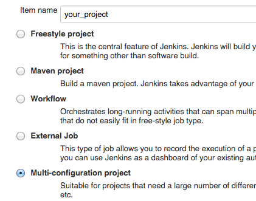
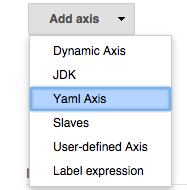
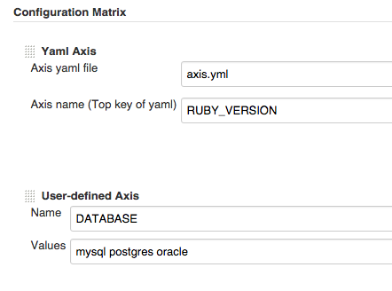
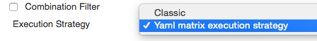
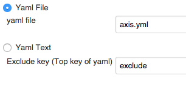
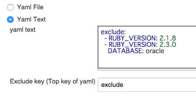
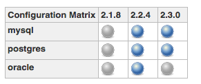

[[YamlAxisPlugin-Summary]]
== Summary

Matrix project axis creation and exclusion plugin using yaml file (It's
similar to .travis.yml)

https://wiki.jenkins-ci.org/display/JENKINS/Yaml+Axis+Plugin[[.confluence-embedded-file-wrapper]#image:http://sebastian-badge.info/plugins/yaml-axis.svg[image]#]
https://jenkins.ci.cloudbees.com/job/plugins/job/yaml-axis-plugin/[[.confluence-embedded-file-wrapper]#image:https://jenkins.ci.cloudbees.com/buildStatus/icon?job=plugins/yaml-axis-plugin[image]#]

[[YamlAxisPlugin-Tableofcontent]]
=== Table of content

[[YamlAxisPlugin-Usage]]
== Usage

[[YamlAxisPlugin-1.Addyamlfiletorepository]]
=== 1. Add yaml file to repository

example

[source,syntaxhighlighter-pre]
----
# axis.yml
RUBY_VERSION:
  - 2.1.8
  - 2.2.4
  - 2.3.0

exclude:
  - RUBY_VERSION: 2.1.8
  - RUBY_VERSION: 2.3.0
    DATABASE: oracle
----

[[YamlAxisPlugin-2.CreateMulti-configurationproject]]
=== 2. Create Multi-configuration project

[.confluence-embedded-file-wrapper]##

[[YamlAxisPlugin-3.ConfigurationMatrix]]
=== 3. Configuration Matrix

Choose *Yaml Axis*

[.confluence-embedded-file-wrapper]##

Input configurations

[.confluence-embedded-file-wrapper]##

* *Axis yaml file* : Yaml file path (relative path from workspace or
absolute path)
* *Axis name* : Top key in yaml file

You can combine *Yaml Axis* and other axes

[[YamlAxisPlugin-4.ConfigurationExecutionStrategy]]
=== 4. Configuration Execution Strategy

[[YamlAxisPlugin-Choose"Yamlmatrixexecutionstrategy"atExecutionStrategy]]
==== Choose "Yaml matrix execution strategy" at Execution Strategy

[.confluence-embedded-file-wrapper]##

If you don't want to exclusion, choose **Classic**

[[YamlAxisPlugin-Inputsettings]]
==== Input settings

[[YamlAxisPlugin-Example1(Useyamlfile)]]
===== Example 1 (Use yaml file)

[.confluence-embedded-file-wrapper]##

[[YamlAxisPlugin-Example2(Useyamltext)]]
===== Example 2 (Use yaml text)

[.confluence-embedded-file-wrapper]##

[[YamlAxisPlugin-4.Buildjob]]
=== 4. Build job

Generate yaml based matrix and run job

[.confluence-embedded-file-wrapper]##

* blue is executed job
* gray is excluded(skipped) job

[[YamlAxisPlugin-Changelog]]
== Changelog

Details
https://github.com/jenkinsci/yaml-axis-plugin/blob/master/CHANGELOG.md

[[YamlAxisPlugin-Version0.2.0]]
=== Version 0.2.0

* Add YamlMatrixExecutionStrategy
** https://github.com/jenkinsci/yaml-axis-plugin/pull/10

[[YamlAxisPlugin-Version0.1.2]]
=== Version 0.1.2

* Fix java.lang.VerifyError
** https://github.com/jenkinsci/yaml-axis-plugin/issues/6

[[YamlAxisPlugin-Version0.1.1]]
=== Version 0.1.1

* Suppress error
* a few refactoring

[[YamlAxisPlugin-Version0.1.0]]
=== Version 0.1.0

* First release
