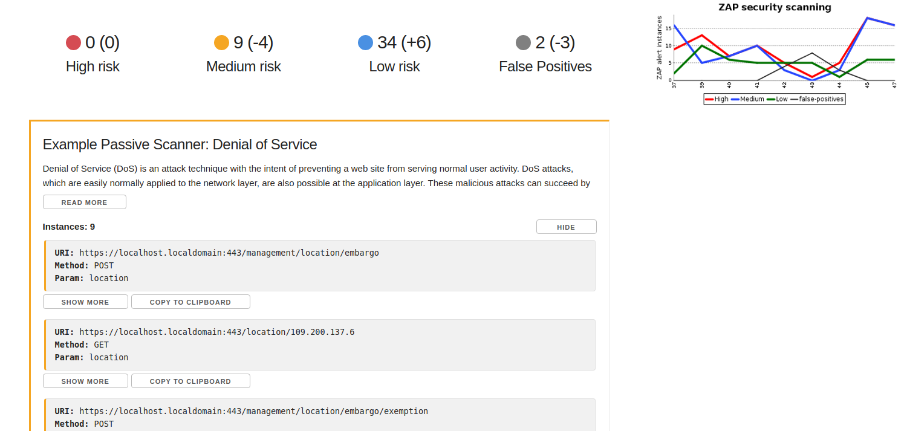

 +
OWASP ZAP is one of the world's most popular free security tools, it can
help you automatically find security vulnerabilities in your web
applications. This plugin allows you to control ZAP in Jenkins pipeline
builds, and also adds additional functionality like the ability to fail
a build if a certain amount of alerts are found, a graph, and much more!
It is recommended you proxy your tests through ZAP for maximum coverage,
but you can also import a list of URLs to scan or load a session to
attack.

 +

[.confluence-embedded-file-wrapper .confluence-embedded-manual-size]##

[[ZAPPipelinePlugin-Features]]
== Features

* Gives you full control over ZAP through Pipeline, including starting
ZAP, running the crawler, running an attack, importing a list of URLs, 
importing scan policies, loading a session & user, ect.
* Generates a graph showing amount of ZAP alerts over builds
* Generates an interactive report (viewable after ZAP has run through
the sidebar button). This report incorporates the results of the
previous build to show you new alerts, automatically filters out
false-positives, and more!
* Ability to fail builds if a certain amount of high/medium/low alerts
are found
* Allows you to provide a false positive file
* Support for distributed builds
* Supports Windows & Linux
* Simple & easy to use

[[ZAPPipelinePlugin-InstallationSteps]]
== Installation Steps

. Go to the Jenkins Dashboard
. Click on "Manage Jenkins" in the sidebar
. Click on "Manage Plugins"
. Press the "Available" tab next to the "Updates" tab
. Search for "zap pipeline" and select the checkbox, then press
"Download now and install after restart"
. Tick the "Restart Jenkins when installation is complete and no jobs
are running" check box

[[ZAPPipelinePlugin-Howtouse]]
== How to use

The plugin provides additional functions for you to use in your
Jenkinsfile. An example of a declarative pipeline is below, the
functions work the same on a scripted pipeline. See the API below for
more information.

[source,syntaxhighlighter-pre]
----
pipeline {
    agent any
    stages { 
        stage('Setup') {
            steps {
                script {
                    startZap(host: "127.0.0.1", port: 9091, timeout:500, zapHome: "/opt/zaproxy", sessionPath:"/somewhere/session.session", allowedHosts:['github.com']) // Start ZAP at /opt/zaproxy/zap.sh, allowing scans on github.com (if allowedHosts is not provided, any local addresses will be used
                }
            }
        }
        stage('Build & Test') {
            steps {
                script {
                    sh "mvn verify -Dhttp.proxyHost=127.0.0.1 -Dhttp.proxyPort=9091 -Dhttps.proxyHost=127.0.0.1 -Dhttps.proxyPort=9091" // Proxy tests through ZAP
                }
            }
        }
    }
    post {
        always {
            script {
                archiveZap(failAllAlerts: 1, failHighAlerts: 0, failMediumAlerts: 0, failLowAlerts: 0, falsePositivesFilePath: "zapFalsePositives.json")
            }
        }
    }
}
----

[[ZAPPipelinePlugin-Availablefunctions]]
== Available functions

Listed below are functions that you can use in your Jenkinsfile.

*startZap*

[source,syntaxhighlighter-pre]
----
startZap(host: "127.0.0.1", port: 9095, timeout: 900, zapHome: "/opt/zaproxy", allowedHosts:['10.0.0.1'], sessionPath:"/path/to/session.session")

Starts the ZAP process and configures the plugin.

host:                       The host to run the ZAP proxy server on. Passed to ZAP in the -host parameter.
port:                       The port to run the proxy on
timeout (optional):         If a scan takes too long it will stop
allowedHosts (optional):    Once the active ZAP scan starts, it won't scan any hosts unless they are here. If you don't set this it will only scan if the host is localhost
sessionPath (optional):     If you want to load a previous ZAP session that you have expored, you can do that here. Useful when you want to run a scan but don't want to run all your tests through ZAP.
----

*runZapCrawler*

[source,syntaxhighlighter-pre]
----
runZapCrawler(host: "https://localhost")

Runs ZAP's web crawler on a specific host
----

*importZapScanPolicy*

[source,syntaxhighlighter-pre]
----
importZapScanPolicy(policyPath: "/home/you/yourattackpolicy.policy")

Imports a ZAP attack scan policy from the path you specify (Scan Policy Manager -> Export). This is to be used with the runZapAttack function
----

*importZapUrls*

[source,syntaxhighlighter-pre]
----
importZapUrls(path: "/path/to/your/urls")

Imports a list of URLs from a file. Usually you would use this with Report->Export all URLs to file in ZAP. 
----

*runZapAttack*

[source,syntaxhighlighter-pre]
----
runZapAttack(userId: 5, scanPolicyName: "yourScanPolicy")

Once you have proxied your tests through ZAP, imported a session in startZap or loaded a list of URLs, you can run the ZAP attack. This function runs an active scan on all the hosts that have been provided in the allowedHosts parameter in startZap. If the parameter is not provided it will default to local hosts only.

userId (optional):          Run the scan with a specific user, loaded from the session
scanPolicyName (optional):  The attack policy to use when running the scan. Loaded with importScanPolicy
----

*archiveZap*

[source,syntaxhighlighter-pre]
----
archiveZap(failAllAlerts: 1, failHighAlerts: 0, failMediumAlerts: 0, failLowAlerts: 0, falsePositivesFilePath: "zapFalsePositives.json")

Reads the alerts found by ZAP, filters out any false positives if a false positives file is provided in the project, checks if there are any alerts that are higher than the fail build parameters - and fails the build if so - generates a report, and finally shuts down ZAP. This should be the last thing you run.

failAllAlerts (optional):           The maximum number of total alerts required to fail a build.
failHighBuild (optional):           Maximum amount of high risk alerts that can happen before a build will fail
failMediumAlerts (optional):        The maximum number of medium alerts required to fail a build.
failLowAlerts (optional):           The maximum number of low alerts required to fail a build.
falsePositivesFilePath (optional):  The path relative to your workspace / project of the false positives file. See below for information on creating this file.
----

[[ZAPPipelinePlugin-Proxyingyourtests]]
== Proxying your tests

*Proxying tests example*

[source,syntaxhighlighter-pre]
----
sh "mvn verify -Dhttp.proxyHost=127.0.0.1 -Dhttp.proxyPort=9095 -Dhttps.proxyHost=127.0.0.1 -Dhttps.proxyPort=9095"
----

You may need to exclude some hosts from ZAP. If so you can use the
-Dhttp.nonProxyHosts parameter, eg -Dhttp.nonProxyHosts=.com\|.co.uk

[[ZAPPipelinePlugin-Proxyinglocalhost]]
== Proxying localhost

By default Java will not proxy localhost, 127.0.0.1, or any common
loopback addresses. There is no way to disable this unless you set
-Dhttp.nonProxyHosts= (empty). This means it is impossible to proxy just
localhost without editing project code. You can mitigate this issue by
changing your applications host to localhost.localdomain, which isn't
checked by Java. An alternative to this is to edit your machines 'hosts'
file and add your own local hostname.

[[ZAPPipelinePlugin-Generatingafalsepositivesfile]]
== Generating a false positives file

You can provide a JSON file of false positive definitions from your
workspace to the plugin during the archive step. The default filename is
zapFalsePositives.json. The file must consist of a JSON array of false
positive objects. For example:

*False positive example*

[source,syntaxhighlighter-pre]
----
[
  {
    "name": "Cross Site Scripting (Reflected)",
    "cweid": "79",
    "wascid": "8",
    "uri": "https:\/\/yourdomain.com\/a\/certain\/url",
    "method": "POST",
    "param": "param1",
    "attack": "",
    "evidence": ""
  },
  {
    "uri": "https:\/\/yourdomain.com\/another/*.",
    "method": "GET"
  }
]
----

All alert instances that match to a false positive object are ignored
when the plugin decided whether to fail your build or not, and are
initially hidden in the UI report. A match is when ALL fields provided
in the false positive object are equal to an alert instance. It is best
practice to be as specific as possible to not hide true positives that
may occur. The false positive URI is a regex string, alert instance URIs
will be tested against this, it is useful to use if you have a dynamic
path.

To aid in the generation of a false positives file, the UI report
provides a 'Copy to Clipboard' button under each instance. This copies
the alert instance as JSON, which can be used as a false positive object
in the false positives file.

[[ZAPPipelinePlugin-VersionHistory]]
== Version History

[[ZAPPipelinePlugin-1.9.0(14thJanuary2019)]]
=== 1.9.0 (14th January 2019)

Fixed start-up error on certain networks 

[[ZAPPipelinePlugin-1.8.0(9thJanuary2019)]]
=== 1.8.0 (9th January 2019)

Added export as XML and export as JSON buttons to the report.

Stopped spamming the console with scan progress messages

[[ZAPPipelinePlugin-1.5.1(31stOctober2018)]]
=== 1.5.1 (31st October 2018)

Lowered minimum required Jenkins version from 2.7.3 to 2.121.1

[[ZAPPipelinePlugin-1.5.0(23rdOctober2018)]]
=== 1.5.0 (23rd October 2018)

Added 32 unit and integration tests. 

ImportZapUrls fails the build if you do not provide the path parameter
or if the file failed to load.

RunZapCrawler no longer provides a default host to start the crawler on
and will fail if you do not provide the host parameter.

If zapHome in startZap is not set the build will now fail, instead of
carrying on silently.

Changed "Zap alert instances" to "Alert instances" on the chart, so the
text is larger. Additionally, the chart now counts the alert instances
rather than the number of alerts (bug)

Improved the UI report.

[[ZAPPipelinePlugin-1.4.1(15thOctober2018)]]
=== 1.4.1 (15th October 2018)

Fixed archiving, general bug fixes and code improvements. If you were
using a previous version before this the report view button will be lost
on your old builds due to naming changes.

[[ZAPPipelinePlugin-1.4(9thOctober2018)]]
=== 1.4 (9th October 2018)

Instead of comparing alerts to the previous build, you can now provide a
false positives file in your projects, and alerts will be filtered using
this file.

There is now a graph that displays on the Jenkins job page that shows
you the amount of alert instances over your builds.

Previously, it was impossible to know that the build failed due to ZAP
without checking the build console. There is now text on the build page
which makes that clear.

The plugin was renamed since the previous version, remember to uninstall
zap-comp.hpi so you don't have it installed twice.

[[ZAPPipelinePlugin-1.2.0(14thSeptember2018)]]
=== 1.2.0 (14th September 2018)

You can now have multiple nodes running at once

[[ZAPPipelinePlugin-1.1.0(12thSeptember2018)]]
=== 1.1.0 (12th September 2018)

Added support for Windows

[[ZAPPipelinePlugin-1.0.0(11thSeptember2018)]]
=== 1.0.0 (11th September 2018)

Initial release

 +
